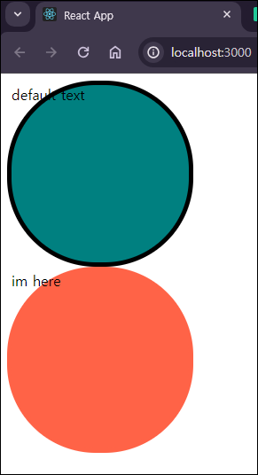

# #3.0 TypeScript

> ### TypeScript
>
> - JavaScript 를 기반으로 한 프로그래밍 언어
> - JavaScript 와 다른 프로그래밍 언어지만 문법은 거의 같고, 새로운 기능만 추가된다.
> - 언어가 작동하기 전에 type을 확인한다. (프로그램을 돌리기전에 무엇이 잘못되었는지 알려준다.)
> - 컴퓨터는 JavaScript 밖에 이해할 수 없어서 publish전에 JavaScript가 TypeScript로 compile 해준다.
>
> #### 💡 프로그래밍 언어가 작동하기 전에 잘못됐다고 말해주는 보호장치인 TypeScript
>
> [TypeScript 테스트 - Typescript 플레이그라운드](https://www.typescriptlang.org/play)  
> [TypeScript 공식문서](https://create-react-app.dev/docs/adding-typescript)  
> [DefinitelyTyped](https://github.com/DefinitelyTyped/DefinitelyTyped)  
> &nbsp;


## Typescript 설정

1. Create React App을 타입스크립트로 시작하기(이게 제일 편함,,,)

   ```
   npx create-react-app my-app --template typescript
   ```

2. 기존 Create React App으로 만든 프로젝트에 타입스크립트 설치

   ```
   npm install --save typescript @types/node @types/react @types/react-dom @types/jest
   ```

   - TypeScript 확장자 변경 `.ts` / React에서 TypeScript 확장자는 `.tsx` ( .js ➡ .tsx )
   - 다음 명령어로 tsconfig.json 파일 생성

     ```bash
     npx tsc --init

     # tsconfig.json 파일 생성 후
     # "compilerOptions": {} 내부에 "jsx": "preserve" 주석해제
     # "compilerOptions": {} 밑에 ,"include": ["src"] 추가
     ```

   - index.tsx 부분 수정

     ```javascript
     const root = ReactDOM.createRoot(
      document.getElementById("root") as HTMLElement
     );
     ```

- styled-components 설치

  🚨 styled-components v6에서는 타입스크립트가 기본으로 탑재되어 있어 따로 설치 안해도 된다.  
  ( styled-components 버전은 package.json 에 나와있다. )

  ```
  npm i --save-dev @types/styled-components
  ```

  > ### @type란?
  >
  > 매우 큰 Github repository, 모든 유명한 npm 라이브러리를 가지고 있는 저장소.  
  > &nbsp;

## Typing the Props

> ### interface
>
> : object shape 을 TypeScript 에게 설명해준다.
>
> Prop Types와 매우 유사하지만 다른점이 있다.
>
> - Prop Types 는 코드가 실행된 후 브라우저에서 에러 확인
> - Interface 는 코드가 실행되기 전에 에러 확인  
>   &nbsp;

- interface를 통해 컴포넌트 props에 type을 줄 수 있다.

  1. App.tsx 에서 Circle 컴포넌트 2개를 return 하고 Circle 컴포넌트한테 각각 `bgColor="teal"`,`bgColor="tomato"` props 를 보낸다.
  2. Circle 컴포넌트가 받은 props의 타입이 뭔지 설명해주기위해 `CircleProps interface` 를 만든다.
  3. 이제 return 할 스타일 컴포넌트인 `<Container />` 도 props를 보낼건데 이 props도 타입이 뭔지 설명해주기위해 `ContainerProps interface` 를 만든다.
  4. TypeScript 에게 bgColor가 뭔지 말해줬기 때문에 `${props => props.}` 에서 자동완성 기능으로 완성할 수 있다.

  ### `Circle.tsx`

  ```javascript
  import styled from "styled-components";

  interface ContainerProps {
    bgColor: string;
  }

  const Container =
    styled.div <
    ContainerProps >
    `
    width: 200px;
    height: 200px;
    background-color: ${(props) => props.bgColor};
    border-radius: 100px;
  `;

  interface CircleProps {
    bgColor: string;
  }

  function Circle({ bgColor }: CircleProps) {
    return <Container bgColor={bgColor} />;
  }

  export default Circle;
  ```

  ### `App.tsx`

  ```javascript
  import styled, { keyframes } from "styled-components";
  import Circle from "./Circle";

  function App() {
    return (
      <div>
        <Circle bgColor="teal" />
        <Circle bgColor="tomato" />
      </div>
    );
  }

  export default App;
  ```

## Optional Props


- Circle 컴포넌트의 bgColor가 required이기 때문에, App.tsx의 Circle에 bgColor를 지우면 빨간줄을 치면서 오류를 감지한다.  
  💡 만약 꼭 필요하지 않은 props를 만들고 싶다면?

### 꼭 필요하지 않은 props를 선택적(optional)으로 만들수 있는 방법


- 위와 같이 `물음표(?)` 를 붙여주면 borderColor 는 없을 수도 있는 optional이 된다.
  - 이제 App.tsx 의 Circle 에는 props에 borderColor 가 없어도 오류가 뜨지 않는다.
- borderColor 는 `string` 또는 `undefined` 중 하나이다.
- 이제 borderColor 를 스타일 컴포넌트`<Container/>` 로 보내줄건데, `<Container/>` 는 아직 borderColor 가 뭔지 모르는 상태이므로 `ContainerProps interface` 에도 적어줘야한다.

  ```javascript
  // Circle.tsx

  interface ContainerProps {
    bgColor: string;
    borderColor: string;
  }

  const Container =
    styled.div <
    ContainerProps >
    `
    width: 200px;
    height: 200px;
    background-color: ${(props) => props.bgColor};
    border-radius: 100px;
    border: 5px solid ${(props) => props.borderColor};
  `;
  ```


- `ContainerProps interface` 에 borderColor를 추가해줬으나 App.tsx 는 둘중 하나의 컴포넌트만 borderColor 를 props 로 받고 있어서 `<Container/>`컴포넌트는 여전히 오류가 나있는 상태이다.
- 초기값을 주는걸로 해결할 수 있다.

  - undefined된 상태라면 borderColor는 bgColor와 같은 값을 가지게 설정 할 수 있다.
  - `borderColor={borderColor ?? "red"}`을 넣어 초기color를 고정할 수 있다.

  ```javascript
  function Circle({ bgColor, borderColor }: CircleProps) {
    return (
      <Container
        bgColor={bgColor}
        borderColor={borderColor ?? bgColor}
      ></Container>
    );
  }
  ```

> ### ?? [ Null 병합 연산자 (Nullish coalescing operator)]
>
> ?? 앞에 값이 null이거나 undefined이면 오른쪽 값을, 그렇지 않으면 왼쪽 값을 반환하는 논리연산자  
> &nbsp;

### 실행결과


- defalut 값 주는 방법 (TypeScript가 아니라 ES6JS문법이다.)  
   => 만약 text props가 존재하지 않는다면 default text를 표출

  ### `App.tsx`

  ```javascript
  function App() {
    return (
      <div>
        <Circle borderColor="black" bgColor="teal" />
        <Circle text="im here" bgColor="tomato" />
      </div>
    );
  }
  ```

  ### `Circle.tsx`

  ```javascript
  interface CircleProps {
    bgColor: string;
    borderColor?: string;
    text?: string;
  }

  function Circle({
    bgColor,
    borderColor,
    text = "default text",
  }: CircleProps) {
    return (
      <Container bgColor={bgColor} borderColor={borderColor ?? bgColor}>
        {text}
      </Container>
    );
  }
  ```

### 실행결과


