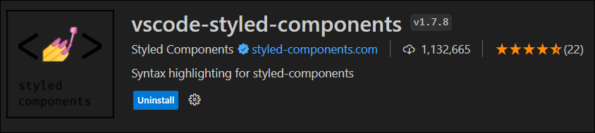
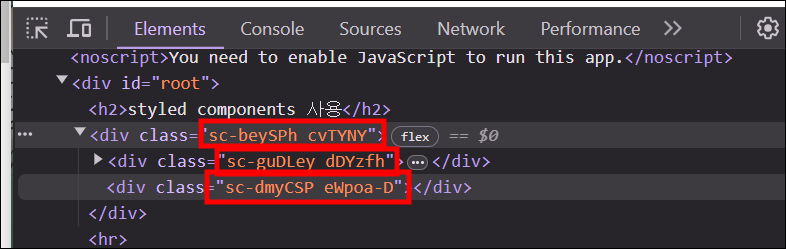

# Styled Component

> ### Styled Components
>
> - 컴포넌트 코드 안에서 CSS 문법을 적용한 컴포넌트를 직접 정의하는 것이다.
> - 즉, 자바스크립트 안에서 CSS를 사용할 수 있도록 도와주는 프레임워크이다. (CSS-in-JS)
> - React 컴포넌트에 특정 스타일링을 할 수 있기 때문에 재사용성을 높일 수 있고, 자바스크립트에 영향을 받는 스타일링을 간편하게 구현할 수 있다.
> - styled components는 현존하는 CSS-in-JS 라이브러리 중에 가장 널리 사용되고 있는 라이브러리이다.
>
> [ 공식문서 - styled components ](https://styled-components.com/)  
> &nbsp;

### 1. 기본 설정

- Styled Components는 `styled-components` 라는 패키지명을 가지고 있다.

  ```
  npm i styled-components
  ```

- Styled Components 패키지 import

  ```javascript
  import styled from "styled-components";
  ```

- VScode에서 styled components 지원을 위한 확장프로그램

  

### 2. 사용방법

- style이 적용된 Component를 직접 생성한다.
- styled.태그이름&#96;css스타일&#96;; 형태로 사용한다.

  ```javascript
  const Father = styled.div`
    display: flex;
  `;
  const BoxOne = styled.div`
    background-color: teal;
    width: 100px;
    height: 100px;
  `;
  const BoxTwo = styled.div`
    background-color: tomato;
    width: 100px;
    height: 100px;
  `;
  const Text = styled.span`
    color: white;
  `;

  function App() {
    return (
      <Father>
        <BoxOne>
          <Text>Hello</Text>
        </BoxOne>
        <BoxTwo />
      </Father>
    );
  }

  export default App;
  ```

- 자동으로 class명을 생성해준다.

  
