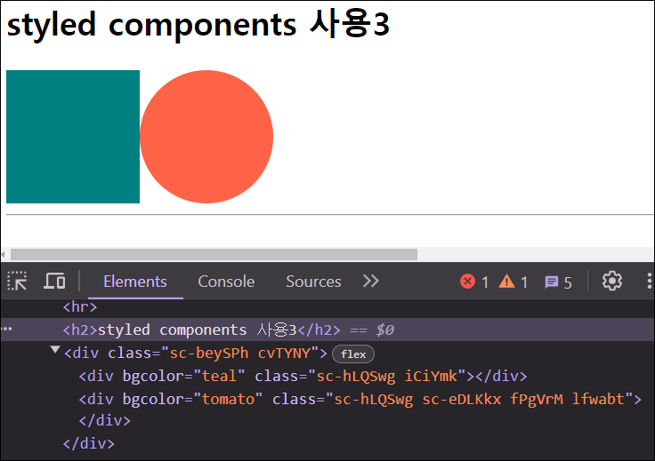
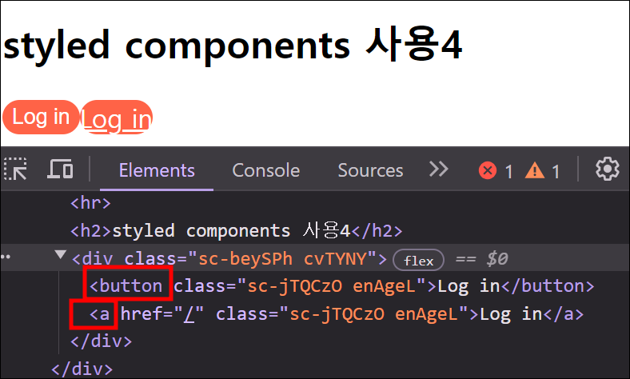
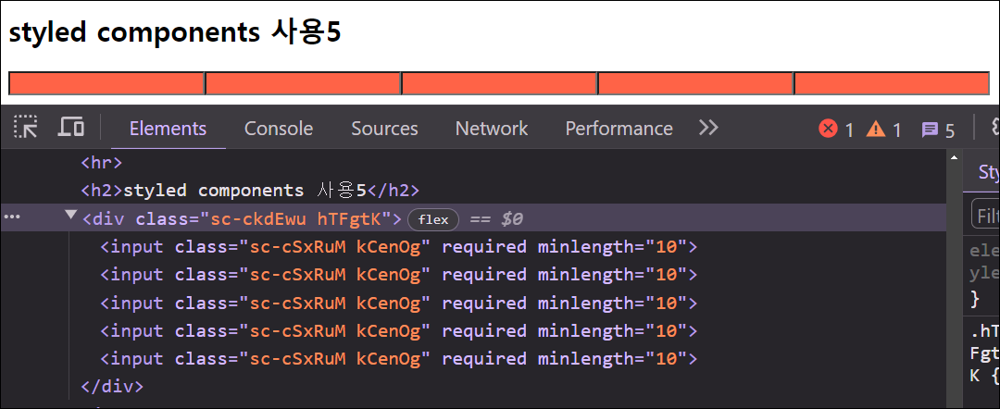
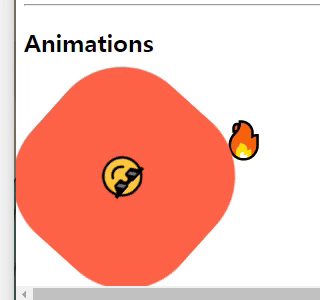
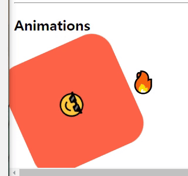
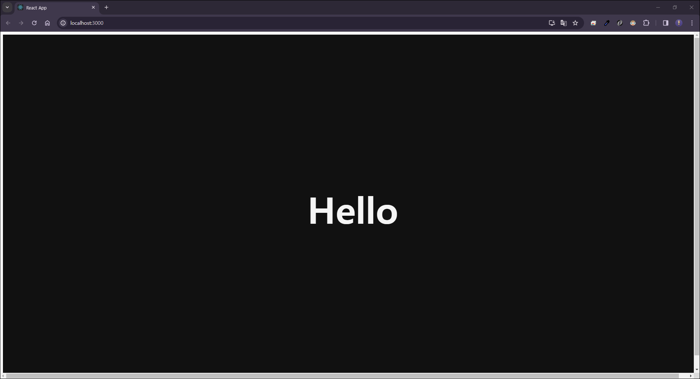
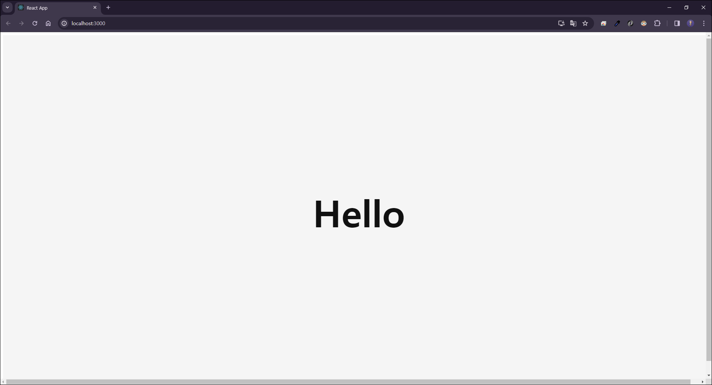

# Styled Component

> ### Styled Components
>
> - 컴포넌트 코드 안에서 CSS 문법을 적용한 컴포넌트를 직접 정의하는 것이다.
> - 즉, 자바스크립트 안에서 CSS를 사용할 수 있도록 도와주는 프레임워크이다. (CSS-in-JS)
> - React 컴포넌트에 특정 스타일링을 할 수 있기 때문에 재사용성을 높일 수 있고, 자바스크립트에 영향을 받는 스타일링을 간편하게 구현할 수 있다.
> - styled components는 현존하는 CSS-in-JS 라이브러리 중에 가장 널리 사용되고 있는 라이브러리이다.
>
> [ 공식문서 - styled components ](https://styled-components.com/)  
> &nbsp;

### 1. 기본 설정

- Styled Components는 `styled-components` 라는 패키지명을 가지고 있다.

  ```
  npm i styled-components
  ```

- Styled Components 패키지 import

  ```javascript
  import styled from "styled-components";
  ```

- VScode에서 styled components 지원을 위한 확장프로그램

  

### 2. 사용방법

- style이 적용된 Component를 직접 생성한다.
- styled.태그이름&#96;css코드&#96;; 형태로 사용한다.

  ```javascript
  const Wrapper = styled.div`
    display: flex;
  `;
  const BoxOne = styled.div`
    background-color: teal;
    width: 100px;
    height: 100px;
  `;
  const BoxTwo = styled.div`
    background-color: tomato;
    width: 100px;
    height: 100px;
  `;
  const Text = styled.span`
    color: white;
  `;

  function App() {
    return (
      <Wrapper>
        <BoxOne>
          <Text>Hello</Text>
        </BoxOne>
        <BoxTwo />
      </Wrapper>
    );
  }
  ```

- 자동으로 class명을 생성해준다.

  

- 컴포넌트의 `props`를 전달받아 사용하는 것이 가능하다.
- `${}` 는 자바스크립트 형식인지 인지해주는 역할을 한다.
- ` styled(extend할 컴포넌트명)``; ` 로 컴포넌트를 extend 할 수 있다.

  ```javascript
  const Wrapper = styled.div`
    display: flex;
  `;
  // props를 통해 중복되는 스타일을 줄일 수 있다.
  const Box = styled.div`
    background-color: ${(props) => props.bgColor};
    width: 100px;
    height: 100px;
  `;
  // Box의 모든 스타일에서 "border-radius" 스타일 추가 (extend)
  const Circle = styled(Box)`
    border-radius: 50px;
  `;

  function App() {
    return (
      <>
        <Wrapper>
          <Box bgColor="teal" />
          <Circle bgColor="tomato" />
        </Wrapper>
      </>
    );
  }
  ```

  

- 컴포넌트의 태그를 바꾸고 싶은데 스타일은 바꾸고 싶지 않을 때 `as` 를 사용하여 다른 태그로 변경할 수 있다.

  ```javascript
  const Wrapper = styled.div`
    display: flex;
  `;
  const Btn = styled.button`
    color: white;
    background-color: tomato;
    border: 0;
    border-radius: 15px;
  `;

  function App() {
    return (
      <>
        <Wrapper>
          <Btn>Log in</Btn>
          <Btn as="a" href="/">
            Log in
          </Btn>
        </Wrapper>
      </>
    );
  }
  ```

  

- styled.component를 생성할때 `attrs`를 사용하여 속성값을 설정할 수 있다.

  ```javascript
  const Wrapper = styled.div`
    display: flex;
  `;
  const Input = styled.input.attrs({ required: true, minLength: 10 })`
    background-color: tomato;
  `;

  function App() {
    return (
      <>
        <Wrapper>
          <Input />
          <Input />
          <Input />
          <Input />
          <Input />
        </Wrapper>
      </>
    );
  }
  ```

  

### 3. 애니메이션

- 애니메이션 사용을 위해 `keyframes` import

  ```javascript
  import styled, { keyframes } from "styled-components";
  ```

- 애니메이션 스타일을 만든 후 애니메이션을 주고 싶은 스타일에 `animation: ${keyframes이름} 전체진행시간 지연시간 반복횟수` 스타일을 준다.

  ```javascript
  const rotationAnimation = keyframes`
    0% {
      transform: rotate(0deg);
      border-radius: 0px;
    }
    50% {
      border-radius: 100px;
    }
    100% {
      transform: rotate(360deg);
      border-radius: 0px;
    }
  `;
  const BoxMove = styled.div`
    width: 200px;
    height: 200px;
    background-color: tomato;
    animation: ${rotationAnimation} 1s linear infinite;
  `;

  function App() {
    return (
      <>
        <Wrapper>
          <BoxMove />
        </Wrapper>
      </>
    );
  }
  ```

  

### 4. styled component 안의 element를 선택하는 방법

- styled component안에서 하위 태그의 스타일을 작성할 수 있다.

  ```javascript
  const rotationAnimation = keyframes`
  0% {
    transform: rotate(0deg);
    border-radius: 0px;
  }
  50% {
    border-radius: 100px;
  }
  100% {
    transform: rotate(360deg);
    border-radius: 0px;
  }
  `;
  const BoxMove = styled.div`
    width: 200px;
    height: 200px;
    background-color: tomato;
    display: flex;
    justify-content: center;
    align-items: center;
    animation: ${rotationAnimation} 1s linear infinite;
    span {
      font-size: 36px;
      &:hover {
        font-size: 98px;
      }
      &:active {
        opacity: 0;
      }
    }
  `;

  function App() {
    return (
      <>
        <Wrapper>
          <BoxMove>
            <span>😎</span>
          </BoxMove>
        </Wrapper>
      </>
    );
  }
  ```

- styled component 자체를 선택할 수 있다.

  - styled component안에서 하위 태그를 작성하면 태그명에 의존하고 있어 다른 태그로 변경시 styled component안에 작성한 태그명도 변경해줘야한다.

  ```javascript
  // 애니메이션
  const rotationAnimation = keyframes`
  0% {
    transform: rotate(0deg);
    border-radius: 0px;
  }
  50% {
    border-radius: 100px;
  }
  100% {
    transform: rotate(360deg);
    border-radius: 0px;
  }
  `;
  const Emoji = styled.span`
    font-size: 36px;
  `;
  const BoxMove = styled.div`
    width: 200px;
    height: 200px;
    background-color: tomato;
    display: flex;
    justify-content: center;
    align-items: center;
    animation: ${rotationAnimation} 1s linear infinite;
    ${Emoji} {
      &:hover {
        font-size: 98px;
      }
      &:active {
        opacity: 0;
      }
    }
  `;

  function App() {
    return (
      <>
        <Wrapper>
          <BoxMove>
            <Emoji as="p">😎</Emoji>
          </BoxMove>
          <Emoji as="p">🔥</Emoji>
        </Wrapper>
      </>
    );
  }
  ```

  

### 5. Themes

- `index.js` 에서 `ThemeProvider` 를 import
- `App` 을 `ThemeProvider` 로 감싼다.
- `ThemeProvider` 는 `theme` 이란 porps가 있다.

  - 이를 통해 하위 컴포넌트들은 theme의 color에 접근 할 수 있다.

  ### `index.js`

  ```javascript
  import React from "react";
  import ReactDOM from "react-dom/client";
  import { ThemeProvider } from "styled-components";
  import App from "./App";

  const darkTheme = {
    textColor: "whitesmoke",
    backgroundColor: "#111",
  };
  const lightTheme = {
    textColor: "#111",
    backgroundColor: "whitesmoke",
  };

  const root = ReactDOM.createRoot(document.getElementById("root"));
  root.render(
    <React.StrictMode>
      <ThemeProvider theme={darkTheme}>
        <App />
      </ThemeProvider>
    </React.StrictMode>
  );
  ```

  ### `App.js`

  ```javascript
  // dark모드 / light 모드
  const Wrap = styled.div`
    width: 100vw;
    height: 100vh;
    display: flex;
    justify-content: center;
    align-items: center;
    background-color: ${(props) => props.theme.backgroundColor};
  `;
  const Title = styled.h2`
    font-size: 100px;
    color: ${(props) => props.theme.textColor};
  `;

  const Wrapper = styled.div`
    display: flex;
    justify-content: center;
    align-items: center;
  `;

  function App() {
    return (
      <>
        <Wrap>
          <Title>Hello</Title>
        </Wrap>
      </>
    );
  }
  ```

  ### dark 모드 & light 모드

  <p align="center">
    
    
  </p>
