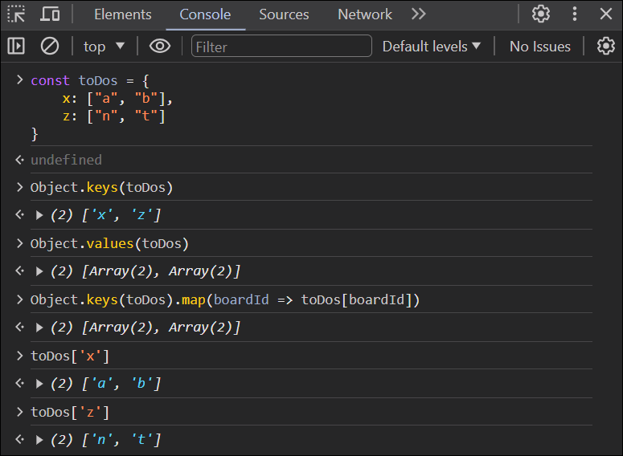
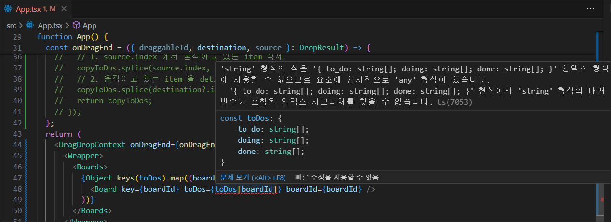
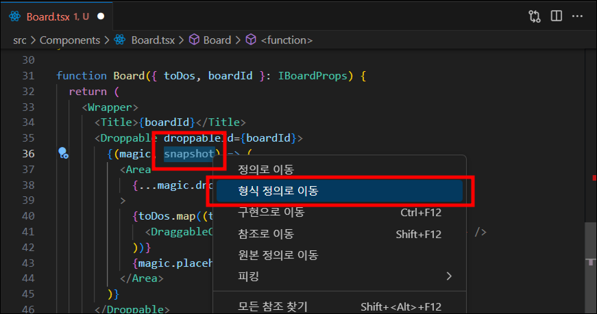
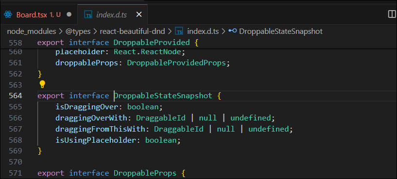

# #7 TRELLO CLONE

## 7.8 Multi Boards



#### 🚨 문제발생

`toDos`는 string으로 이루어진 array인데 `toDos[boardId]` 는 string이 아니라고 나온다.  
타입스크립트는 `toDoState`가 3개의 선택지만 있다고 생각하고 있기때문에 에러가 나고 있다.



#### ✅ 해결방법

추후 사용자가 직접 board를 추가하게 할수도 있으니 `toDoState`는 string의 property와 string array로 이루어져 있다고 정의해준다.

```typescript
// atoms.ts

import { atom, selector } from "recoil";

interface IToDoState {
  [key: string]: string[];
}

export const toDoState = atom<IToDoState>({
  key: "toDo",
  default: {
    to_do: ["a", "b"],
    doing: ["c", "d", "e"],
    done: ["f"],
  },
});
```

## 7.9 Same Board Movement

## 7.10 Cross Board Movement

## 7.11 Droppable Snapshot

`snapshot` 에 오른쪽 클릭 후 `형식 정의로 이동` 을 클릭하면 snapshot으로 뭘 얻을지 보여준다.




styled-component에 isDraggingOver, isDraggingFromThis을 넣으면 콘솔에 뜨는 경고문 해결 방법:

컴포넌트에는

```typescript
$isDraggingOver={info.isDraggingOver}
$isDraggingFromThis={Boolean(info.draggingFromThisWith)}
```

style 정의에는

```typescript
${props => (props.$isDraggingOver ? ... : props.$isDraggingFromThis ? ... : ...)}
```

인터페이스에는

```typescript
interface AreaProps {
  $isDraggingOver: boolean;
  $isDraggingFromThis: boolean;
}
```

이렇게 적어주면 경고문은 안 뜹니다.
우리가 정의한 속성이 DOM element에 비표준 속성으로 전달 되어서 발생되는 경고문이어서, styled-component에서만 사용하겠다는 접두사인 '$'를 붙여주면 해당 속성이 필터링 되어 DOM element에 전달되지 않는다고 하네요.

[참고](https://styled-components.com/docs/basics#passed-props)

## 7.12 Final Styles

## 7.13 Refs

`ref(reference)` : 자바스크립트로부터 HTML 요소를 가져와서 수정하는 방법

`ref`자체는 react.js이지만, HTML Input요소에 있는 focus랑 blur method는 자바스크립트에서 오는 것 이다. [method참고](https://developer.mozilla.org/en-US/docs/Web/API/HTMLInputElement)

## 7.14 Task Objects

state의 형식을 object로 변경하기

## 7.15 Creating Tasks
