# #8 ANIMATIONS

## 8.0 Introduction

> ### Framer Motion
>
> 사용하기 쉬운 ReactJS용 라이브러리
>
> [Framer - 공식사이트](https://www.framer.com/motion)  
> [Framer - GitHub](https://github.com/framer/motion)  
> &nbsp;

## 8.1 Installation

### Framer Motion 설치

[Framer - GitHub | Get started](https://github.com/framer/motion/tree/main/packages/framer-motion#get-started)

```bash
npm install framer-motion
```

### Framer Motion 설정

1. framer-motion import한다.
2. framer motion을 이용해 애니메이션을 만들때는 반드시 HTML태그 앞에 `motion.`을 사용해야한다.

```typescript
// Basic.tsx

import styled from "styled-components";
import { motion } from "framer-motion";

const Wrapper = styled.div`
  width: 100vw;
  height: 100vh;
  display: flex;
  justify-content: center;
  align-items: center;
  background: linear-gradient(135deg, #e09, #d0e);
`;

const Box = styled(motion.div)`
  width: 200px;
  height: 200px;
  background-color: white;
  border-radius: 15px;
  box-shadow: 0 2px 3px rgba(0, 0, 0, 0.1), 0 10px 20px rgba(0, 0, 0, 0.06);
`;

function Basic() {
  return (
    <Wrapper>
      {/* 일반 HTML태그에서 framer motion 애니메이션을 사용할때 */}
      <motion.div></motion.div>
      <Box />
    </Wrapper>
  );
}

export default Basic;
```

위와 같은 과정에서 에러가 발생할 수 도 있다.

그 이유는 create-react-app 버전의 문제( [에러발생 시 참고 영상 - 3:25](https://nomadcoders.co/react-masterclass/lectures/3387) )  
create-react-app 버전4는 EcmaScript module을 허용하지 않아 에러가 발생한다.  
CRACO를 사용해 별도 설정 필요( [CRACO - GitHub](https://github.com/dilanx/craco) )

#### 현재(2024.03.20) create-react-app 버전5 에는 에러가 없다. (별도의 설정 X)

## 8.2 Basic Animations

스타일 컴포넌트와 framer motion 애니메이션을 같이 사용하고 싶을때는 `styled`옆에 바로 HTML태그를 작성하는 대신 `(motion.HTML태그)` 를 작성하여 사용한다.

```typescript
// Basic.tsx

import styled from "styled-components";
import { motion } from "framer-motion";

const Wrapper = styled.div`
  width: 100vw;
  height: 100vh;
  display: flex;
  justify-content: center;
  align-items: center;
  background: linear-gradient(135deg, #e09, #d0e);
`;

const Box = styled(motion.div)`
  width: 200px;
  height: 200px;
  background-color: white;
  border-radius: 15px;
  box-shadow: 0 2px 3px rgba(0, 0, 0, 0.1), 0 10px 20px rgba(0, 0, 0, 0.06);
`;

function Basic() {
  return (
    <Wrapper>
      *{/* 일반 HTML태그에서 framer motion 애니메이션을 사용할때 */}
      <motion.div></motion.div>
      <Box
        transition={{ delay: 3, duration: 3 }}
        animate={{ borderRadius: "100px" }}
      />
    </Wrapper>
  );
}

export default Basic;
```

### 실행화면

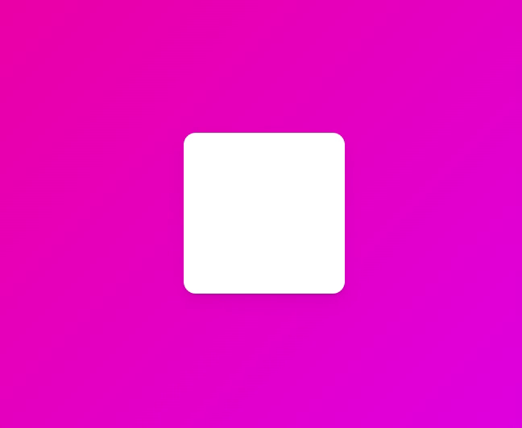

### 첫번째 Animation 따라하기 - `src/components/Motion1.tsx`

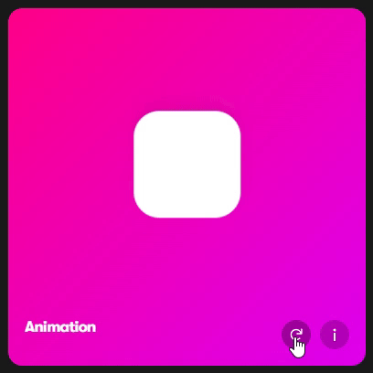

```typescript
<Box
  transition={{ type: "spring", delay: 0.5, bounce: 0.2 }}
  initial={{ scale: 0 }}
  animate={{ scale: 1, rotateZ: 360 }}
/>
```

- `initial={}` : 애니메이션이 시작하는 방식, 초기값.
- `animate={}` : 애니메이션이 작동하는 방식.
- `transition={}` : [공식문서 참고](https://www.framer.com/motion/transition/)
  - `type: "sping"` 이 기본적인 타입이다.(튕기는 모션), `type: "tween"` (깔끔하게 멈추는 모션) 등 ...
  - `stiffness: ` : 경직됨 , `damping: ` : 반동력 등...

### 실행화면

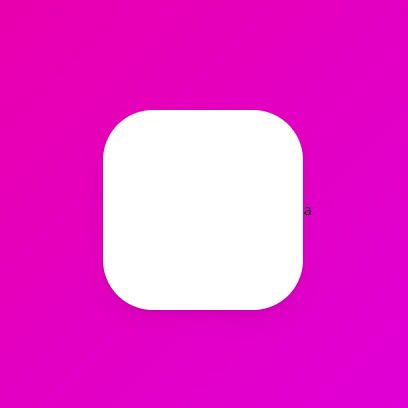

#### 🐞 a 라는 텍스트를 쓴 이유? - [참고](https://github.com/framer/motion/issues/1927)

화면에 텍스트와 같은 다른 컨텐츠가 없으면 발생하는 크롬 브라우저 자체의 버그로 인해 애니이션 작동이 안되기 때문이다.

## 8.3 Variants part One

`Variants`는 코드를 깔끔하게 해주고 많은 애니메이션들을 하나로 연결시켜준다.

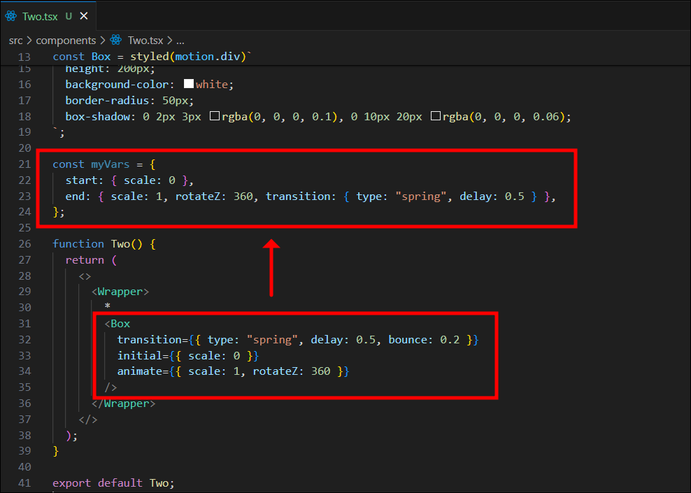

- 앞에서 했던 애니메이션 prop들을 `variant 오브젝트(myVars)`를 만들어서 그대로 옮겨준다.
- Variants는 `초기상태`와 `최종상태`를 가지는 `두 state`를 가진다. (`visible`과`invisible` 또는 `start`와`end`)
- Variants 변수의 이름과 state들의 이름은 마음대로 작성 가능하다.

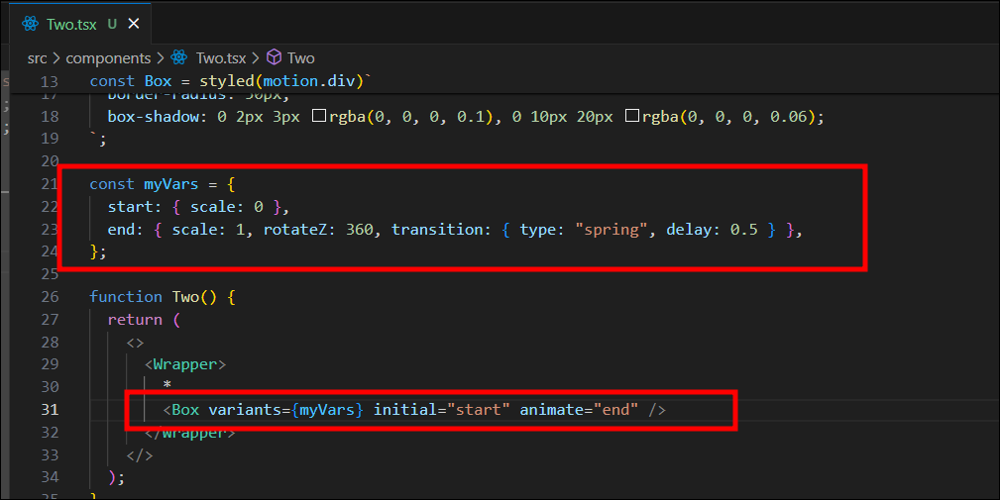

- 만들었던 Variants를 컴포넌트에 적용하는 방법
  - `variants` prop에 만들었던 오브젝트를 전달한다.
  - `initial`, `animate` prop에 오브젝트의 두 state 명을 넣는다.

## 8.4 Variants part Two

### 두번째 Animation 따라하기 - `src/components/Motion2.tsx`

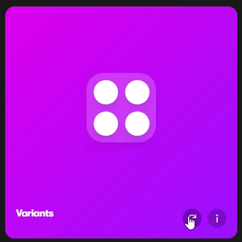

```typescript
import styled from "styled-components";
import { motion } from "framer-motion";

const Wrapper = styled.div`
  width: 100vw;
  height: 100vh;
  display: flex;
  justify-content: center;
  align-items: center;
  background: linear-gradient(135deg, #db01ef, #9b10fe);
`;

const Box2 = styled(motion.div)`
  display: grid;
  grid-template-columns: repeat(2, 1fr);
  width: 200px;
  height: 200px;
  background-color: rgba(255, 255, 255, 0.1);
  border-radius: 40px;
  box-shadow: 0 2px 3px rgba(0, 0, 0, 0.1), 0 10px 20px rgba(0, 0, 0, 0.06);
`;
const Circle = styled(motion.div)`
  width: 70px;
  height: 70px;
  place-self: center;
  background-color: white;
  border-radius: 35px;
  box-shadow: 0 2px 3px rgba(0, 0, 0, 0.1), 0 10px 20px rgba(0, 0, 0, 0.06);
`;

const boxVariants = {
  start: { opacity: 0, scale: 0.5 },
  end: {
    opacity: 1,
    scale: 1,
    transition: {
      type: "spring",
      duration: 0.5,
      bounce: 0.5,
      delayChildren: 0.5,
      staggerChildren: 0.1,
    },
  },
};

const circleVariants = {
  start: { opacity: 0, y: 10 },
  end: { opacity: 1, y: 0 },
};

function Motion2() {
  return (
    <>
      <Wrapper>
        *
        <Box2 variants={boxVariants} initial="start" animate="end">
          <Circle variants={circleVariants} />
          <Circle variants={circleVariants} />
          <Circle variants={circleVariants} />
          <Circle variants={circleVariants} />
        </Box2>
      </Wrapper>
    </>
  );
}

export default Motion2;
```

- `boxVariants 오브젝트`를 만들어서 Box2의 `variants` prop으로 적용하고, `initial`과`animate` prop도 적용한다.
  - Framer Motion은 부모 컴포넌트(Box2)가 있을때 자식 컴포넌트(Circle)에게 variant 속성인 `initial`과 `animate`속성을 자동으로 물려주기 때문에 Circle컴포넌트도 애니메이션 효과가 적용된다.
- `circleVariants 오브젝트`를 만들어 Circle 컴포넌트에는 `variants` prop만 적용한다.
  - 부모 컴포넌트의 `initial`과 `animate`를 물려받았기때문에 `variants`만 적용한다.
  - 다만 variant 오브젝트의 속성 이름이 같아야한다. (start, end)
- Orchestration ([Framer Motion - Orchestration](https://www.framer.com/motion/transition/#orchestration))
  - `delayChildren` : 부모 variants(boxVariants)내에서, 모든 자식들에게 delay할 수 있는 기능
  - `staggerChildren` : 자식들의 delay를 시차를 두고 차례대로 주는 기능

### 실행화면

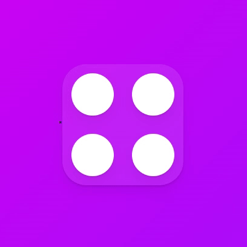

## 8.5 Gestures part One

### 세번째 Animation 따라하기 - `src/components/Motion3.tsx`

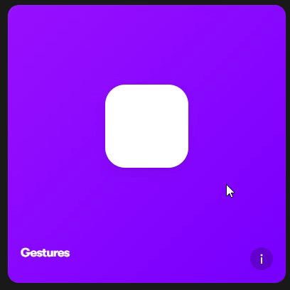

```typescript
import styled from "styled-components";
import { motion } from "framer-motion";

const Wrapper = styled.div`
  width: 100vw;
  height: 100vh;
  display: flex;
  justify-content: center;
  align-items: center;
  background: linear-gradient(135deg, #7500ff, #7801ff);
`;

const Box = styled(motion.div)`
  width: 200px;
  height: 200px;
  background-color: rgba(255, 255, 255, 1);
  border-radius: 40px;
  box-shadow: 0 2px 3px rgba(0, 0, 0, 0.1), 0 10px 20px rgba(0, 0, 0, 0.06);
`;

const boxVariants = {
  hover: { scale: 1.5, rotateZ: 90 },
  click: { scale: 1, borderRadius: "100px" },
};

function Motion3() {
  return (
    <>
      <Wrapper>
        {/* Variants 사용 안한 경우 */}
        {/* 
        <Box
          whileHover={{ scale: 1.5, rotateZ: 90 }}
          whileTap={{ scale: 1, borderRadius: "100px" }}
        />
        */}
        <Box variants={boxVariants} whileHover="hover" whileTap="click" />
      </Wrapper>
    </>
  );
}

export default Motion3;
```

- Gestures | [공식문서 참고](https://www.framer.com/motion/gestures/)
  - `whileHover` : 마우스가 hover 됐을떄 작동한다.
  - `whileTap` : 마우스로 클릭 했을때 작동한다.

### 실행화면

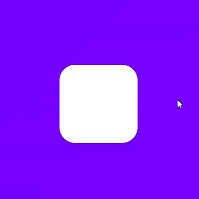

## 8.6 Gestures part Two

### 네번째 Animation 따라하기 - `src/components/Motion4.tsx`

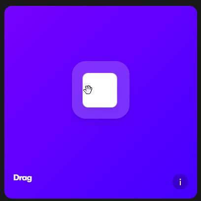

```typescript
import styled from "styled-components";
import { motion } from "framer-motion";

const Wrapper = styled.div`
  width: 100vw;
  height: 100vh;
  display: flex;
  justify-content: center;
  align-items: center;
  background: linear-gradient(135deg, #7500ff, #4500ff);
`;

const Box = styled(motion.div)`
  width: 200px;
  height: 200px;
  background-color: rgba(255, 255, 255, 1);
  border-radius: 40px;
  box-shadow: 0 2px 3px rgba(0, 0, 0, 0.1), 0 10px 20px rgba(0, 0, 0, 0.06);
`;

const boxVariants = {
  hover: { rotateZ: 90 },
  click: { borderRadius: "100px" },
  drag: { backgroundColor: "rgb(46, 204, 113)", transition: { duration: 2 } },
};

function Motion4() {
  const biggerBoxRef = useRef<HTMLDivElement>(null);
  return (
    <>
      <Wrapper>
        <Box
          drag
          variants={boxVariants}
          whileDrag="drag"
          whileHover="hover"
          whileTap="click"
        />
      </Wrapper>
    </>
  );
}

export default Motion4;
```

- drag 기능을 쓰고 싶다면 `drag`를 prop으로 써주면 된다.
- `whileDrag` prop 으로 드래그 하는 동안의 작동하는 코드를 작성할 수 있다.
- `drag: { backgroundColor: "rgb(46, 204, 113)", transition: { duration: 5 } },`
  - 배경색을 적을때 `"blue"` 이런식의 string은 숫자가 아니기 때문에 animate 효과를 적용할 수 없다.  
    그러므로 `rgb(0, 0, 0)` 와 같은 숫자로 작성해야한다.

### 실행화면

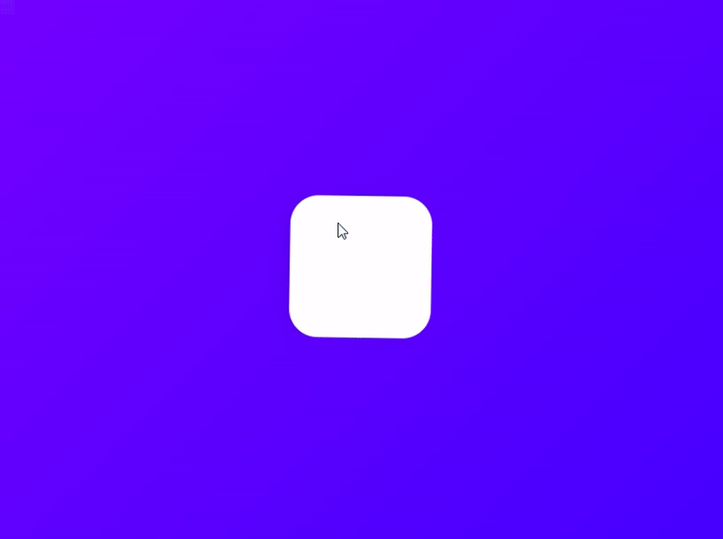

### 드래그 제약(constraint)

drag 속성을 사용하면 어느 방향이나 드래그를 할 수 있다.  
네번째 Animation 처럼 드래그에 제약을 주기 위해서 `dragConstraints` 속성을 사용하면된다.

```typescript
import styled from "styled-components";
import { motion } from "framer-motion";
import { useRef } from "react";

const Wrapper = styled.div`
  width: 100vw;
  height: 100vh;
  display: flex;
  justify-content: center;
  align-items: center;
  background: linear-gradient(135deg, #7500ff, #4500ff);
`;

const BiggerBox = styled.div`
  width: 400px;
  height: 400px;
  display: flex;
  justify-content: center;
  background-color: rgba(255, 255, 255, 0.3);
  border-radius: 40px;
  align-items: center;
  overflow: hidden;
`;

const Box = styled(motion.div)`
  width: 200px;
  height: 200px;
  background-color: rgba(255, 255, 255, 1);
  border-radius: 40px;
  box-shadow: 0 2px 3px rgba(0, 0, 0, 0.1), 0 10px 20px rgba(0, 0, 0, 0.06);
`;

function Motion4() {
  const biggerBoxRef = useRef<HTMLDivElement>(null);
  return (
    <>
      <Wrapper>
        <BiggerBox ref={biggerBoxRef}>
          <Box
            drag
            /* 수학적으로 계산하는 방법 */
            // dragConstraints={{ top: -200, bottom: 200, left: -200, right: 200 }}
            /* 레퍼런스를 이용하는 방법 */
            dragConstraints={biggerBoxRef}
            dragElastic={0.5}
            dragSnapToOrigin
          />
        </BiggerBox>
      </Wrapper>
    </>
  );
}

export default Motion4;
```

- `Box` 컴포넌트를 감싸줄 `BiggerBox` 컴포넌트도 만든 후 `BiggerBox` 범위 밖으로 드래그되면 `Box`컴포넌트가 보이지 않게 `overflow: hidden;` 속성을 추가해준다.
- `dragConstraints`

  - 드래깅이 허용될 수 있는 영역을 정할 수 있는 드래그 제약(constraint).
  - 드래깅이 끝나면 정해놓은 영역안으로 되돌려진다.

- 드래그 제약 2가지 방법

  - 직접 숫자 계산해서 수치 입력
    - `BiggerBox`의 가로,세로가 600이니 크기 (300 - 중앙 박스의 절반)를 계산해서 `BiggerBox` 의 크기만큼만 드래깅이 되게 만든다.
    - `dragConstraints={{ top: -200, bottom: 200, left: -200, right: 200 }}`
  - `useRef()` 사용
    - `useRef()`를 사용해 레퍼런스를 만들어, 이 레퍼런스를 `BiggerBox` ref에 넣어준다.
    - `Box`에 걸어준 constraints에 biggerBox의 가장자리까지 제약할수 있게 설정한다.

- `dragSnapToOrigin` : 원래 위치로 돌아가게 한다.
- `dragElastic` : 원하는 만큼 당기는 것을 조절 할 수 있다. (기본값은 0.5로 0~1이 사용범위다.)
  - 1로 설정하면 마우스로 당기는 만큼 당겨지고 0.5로 설정하면 반만 당겨진다.

### 실행화면

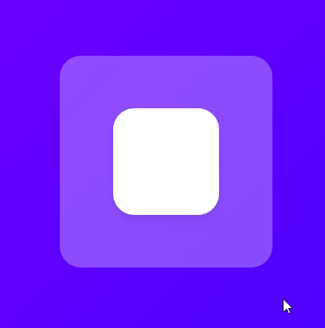

## 8.7 MotionValues part One

`MotionValue`는 애니메이션 내의 수치를 트래킹 할때 필요하므로 매우 중요하다.  
예를들어 유저가 왼쪽으로 드래깅하는지, 오른쪽으로 드래깅하는지가 알고 싶을때 사용할 수 있다.

```typescript
import styled from "styled-components";
import { motion, useMotionValue } from "framer-motion";

const Wrapper = styled.div`
  width: 100vw;
  height: 100vh;
  display: flex;
  justify-content: center;
  align-items: center;
  background: linear-gradient(135deg, #4103ff, #0253ff);
`;

const Box = styled(motion.div)`
  width: 200px;
  height: 200px;
  background-color: rgba(255, 255, 255, 1);
  border-radius: 40px;
  box-shadow: 0 2px 3px rgba(0, 0, 0, 0.1), 0 10px 20px rgba(0, 0, 0, 0.06);
`;

function Motion5() {
  const x = useMotionValue(0);
  console.log(x);

  return (
    <>
      <Wrapper>
        {/* <Box style={{ x : x }} drag="x" dragSnapToOrigin /> */}
        <Box style={{ x }} drag="x" dragSnapToOrigin />
      </Wrapper>
    </>
  );
}

export default Motion5;
```

- Box 컴포넌트에 `drag="x"`를 줘서 X축만 드래깅 되게 만들고 `dragSnapToOrigin`으로 드래그하면 중앙으로 되돌아오게 만든다.
- 유저가 드래깅할때마다 X축의 위치를 추적하기 위해 `useMotionValue()`로 x를 선언해주고 기본값은 0으로 해준다.
- `style={{ x : x }}` 로 useMotionValue의 x를 style의 x와 연결한다. (`style={{ x }}`으로 축약 가능)

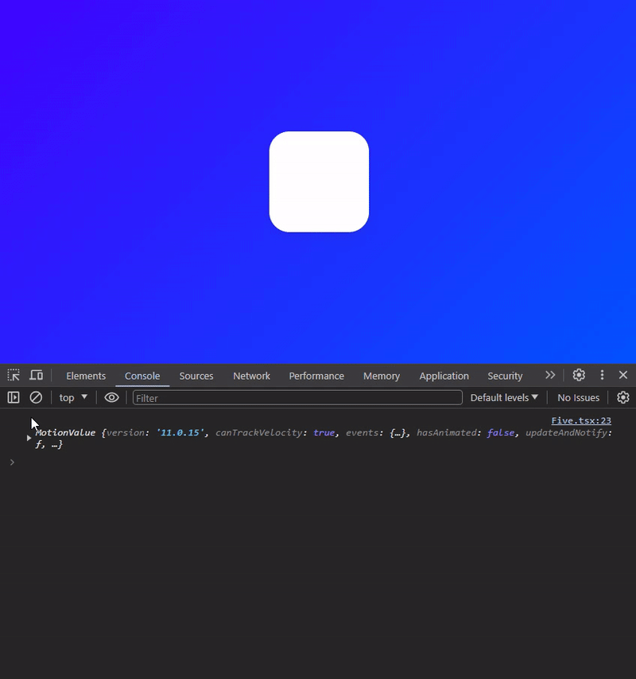

- 드래그를 하고 `console.log(x)`로 x값을 확인해보면 MotionValue는 딱 한번만 출력되고 업데이트되지 않는다. (x값은 드래그할때마다 변하고 있다.)
- 이유는 MotionValue는 ReactJS State(상태)로 작동 하지 않아서 MotionValue가 바뀌어도 컴포넌트를 재렌더링하지 않기 때문이다. ([공식문서 참고](https://www.framer.com/motion/use-motion-value-event/))

### `useEffect()` 를 이용해서 x의 값 보기


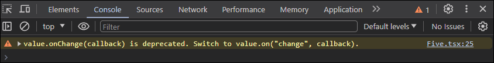

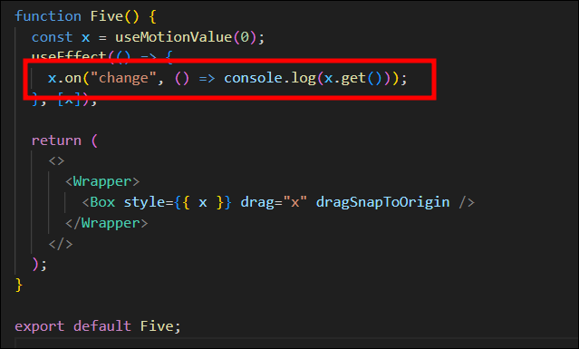

- useEffect 로 x가 바뀔때 마다 `console.log(x.get())`로 x의 값을 얻을 수 있다.
- 첫번째 사진처럼 onChange eventListener를 사용했더니 콘솔창에 경고가 떠서 마지막 사진처럼 문법을 변경하니 잘 작동했다.

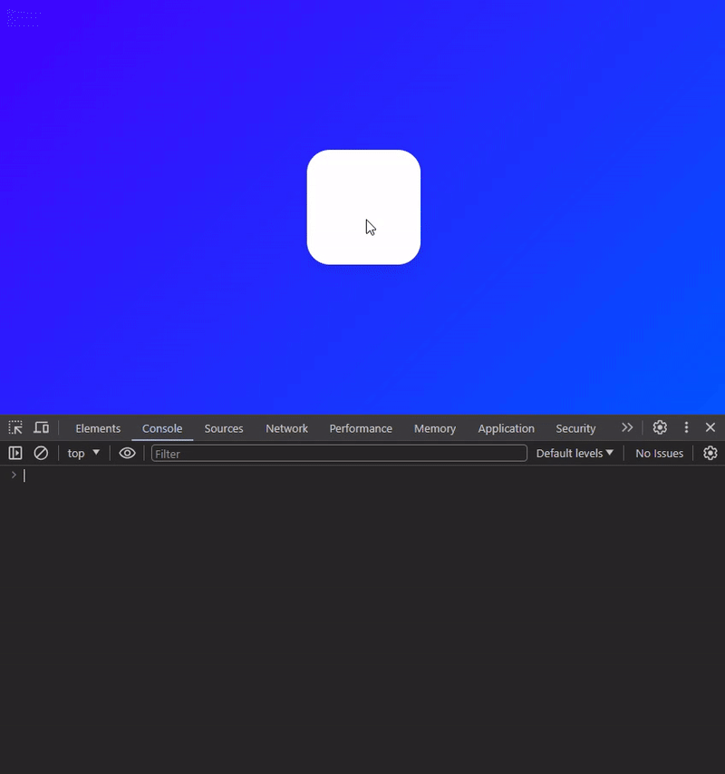

- 위와 같이 드래그 할때마다 바뀌는 x값을 확인할 수 있다.
- Framer Motion의 Motion이 컴포넌트를 실제로 재렌더링 시켰다면 위의 x값이 바뀔때 마다 재렌더링이 되어서 비효율적이였을 것이다.

### button을 클릭해서 x값 변경하기

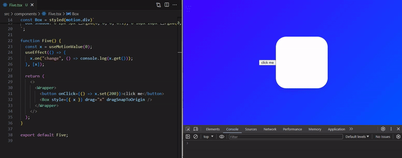

### 🔰 현재는 `useMotionVvalueEvent()` 사용 - `useEffect()` X

```typescript
// useEffect()
useEffect(() => {
  x.on("change", () => console.log(x.get()));
}, [x]);

// useMotionVvalueEvent()
useMotionValueEvent(x, "change", (x) => {
  console.log("x", x);
});
```

## 8.8 MotionValues part Two

`MotionValue`를 이용하여 정사각형을 왼쪽으로 드래그하면 점점 커지고, 오른쪽으로 드래그하면 점점 작아지게 만들어보기

```
-600 ->  2
0    ->  1
600  ->  0
```

화면에 나타나는 x값이 `-600일떄 scale: 2`,`0일땐 scale: 1`, `600일땐 scale: 0` 만큼 크기를 변하게할 transformation의 로직이다.

```typescript
import { motion, useMotionValue, useTransform } from "framer-motion";

...생략

function Motion5() {
  const x = useMotionValue(0);
  const scale = useTransform(x, [-600, 0, 600], [2, 1, 0.1]);

  useEffect(() => {
    // x.on("change", () => console.log(x.get()));
    scale.on("change", () => console.log(scale.get()));
  }, [x]);

  return (
    <>
      <Wrapper>
        <Box style={{ x, scale: scale }} drag="x" dragSnapToOrigin />
      </Wrapper>
    </>
  );
}

export default Motion5;
```

- `useTransform()`을 생성하고 framer-motion 으로부터 import 한다.
  - 첫번째 인자로는 x
  - 두번째 인자로는 배열안에 검토하길 원하는 입력값들을 넣어준다.
  - 세번째 인자로는 배열안에 얻길 원하는 output(출력)값을 넣어준다. (0은 보이지 않으니 0.1로 변경)
  - 입력값과 출력값은 반드시 같은 배열 크기를 가져야한다.
- `style={{ x, scale: scale }}` : state와 style을 연결시켜준다.

### 실행화면

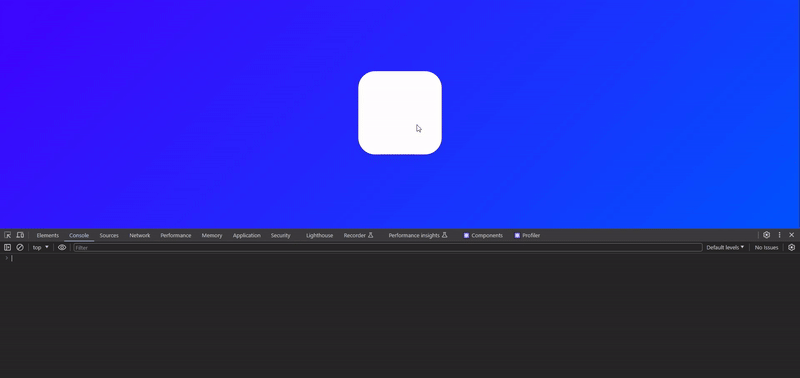

## 8.9 MotionValues part Three

`MotionValue`를 이용하여 x축으로 드래그하면 Box의 회전과 배경색 변경하기

```typescript
const Wrapper = styled(motion.div)`
  width: 100vw;
  height: 100vh;
  display: flex;
  justify-content: center;
  align-items: center;
  background: linear-gradient(135deg, rgb(65, 3, 255), rgb(2, 83, 255));
`;

...생략

function Motion5() {
  const x = useMotionValue(0);
  const rotateZ = useTransform(x, [-800, 800], [-360, 360]);
  const gradient = useTransform(
    x,
    [-800, 800],
    [
      "linear-gradient(135deg, rgb(0, 210, 238), rgb(0, 83, 238))",
      "linear-gradient(135deg, rgb(0, 238, 155), rgb(238, 178, 0))",
    ]
  );
  return (
    <>
      <Wrapper style={{ background: gradient }}>
        <Box style={{ x, rotateZ }} drag="x" dragSnapToOrigin />
      </Wrapper>
    </>
  );
}
```

- Wrapper 컴포넌트에 애니메이션을 적용하기 위해 `(motion.div)`로 변경한다.
- `useTransform()`으로 회전을 구현할 변수 `rotateZ`와 배경색을 변경할 변수 `gradient`를 생성한다.

  - 색상은 string("red", #fff)이 아닌 숫자(rgb)로 되어있어야한다.

- 적용할 컴포넌트에 `style={{ background: gradient }}` 로 연결한다.

### 실행화면


### useScroll

스크롤 애니메이션을 구현하려면 `useScroll`이라는 helper function을 사용해야한다.  
(강의에서는 useViewPortScoll이지만 현재는 useScroll로 변경되었다.) [공식문서 참고](https://www.framer.com/motion/use-scroll/)

> #### `useScroll`은 4개의 모션 값을 반환한다.
>
> - `scrollX` / `scrollY` : 스크롤 위치를 픽셀 단위로 반환.
> - `scrollXProgress` / `scrollYProgress` : 스크롤 위치를 0과 1 사이의 값으로 반환.  
>   &nbsp;

```typescript
const { scrollY, scrollYProgress } = useScroll();
useMotionValueEvent(scrollY, "change", (latest) => {
  console.log("scrollY: ", latest);
});
useMotionValueEvent(scrollYProgress, "change", (latest) => {
  console.log("scrollYProgress: ", latest);
});
```

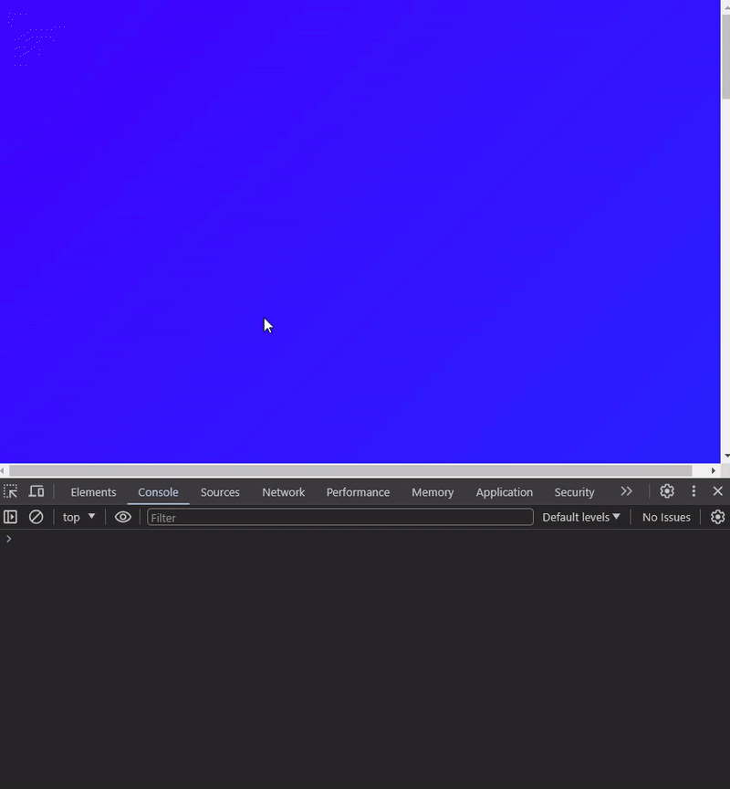

### 다섯번째 Animation 따라하기 - `src/components/Motion6.tsx`


```typescript
import styled from "styled-components";
import {
  motion,
  useMotionValue,
  useMotionValueEvent,
  useScroll,
  useTransform,
} from "framer-motion";

const Wrapper = styled.div`
  width: 100vw;
  height: 200vh;
  display: flex;
  justify-content: center;
  align-items: center;
  background: linear-gradient(135deg, rgb(65, 3, 255), rgb(2, 83, 255));
`;

const Box = styled(motion.div)`
  width: 200px;
  height: 200px;
  background-color: rgba(255, 255, 255, 1);
  border-radius: 40px;
  box-shadow: 0 2px 3px rgba(0, 0, 0, 0.1), 0 10px 20px rgba(0, 0, 0, 0.06);
`;

function Motion6() {
  const x = useMotionValue(0);
  const { scrollY, scrollYProgress } = useScroll();
  const scale = useTransform(scrollYProgress, [0, 1], [1, 3]);
  return (
    <>
      <Wrapper>
        {/* <Box style={{ scale: scale }} /> */}
        <Box style={{ scale: scale }} />
      </Wrapper>
    </>
  );
}

export default Motion6;
```

- `useTransform()`을 이용해 scrollYProgress가 0이면 scale값이 1, scrollYProgress가 1이면 scale값이 3으로 변하게 해준다.
- scale 변수를 Box 컴포넌트에 적용해준다.

### 실행화면

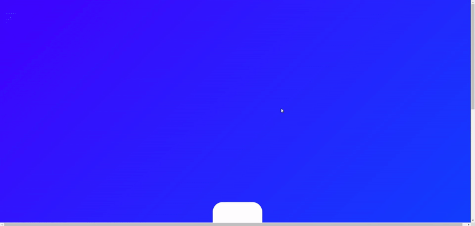

## 8.10 SVG Animation

### 여섯번째 Animation 따라하기 - `src/components/Motion7.tsx`

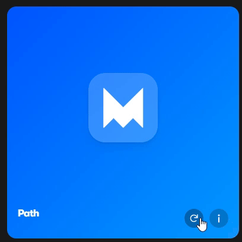

### airbnb 로고로 대체

[폰트어썸 사이트](https://fontawesome.com/icons) 에서 airbnb 로고 아이콘을 svg형태로 복사해온다.

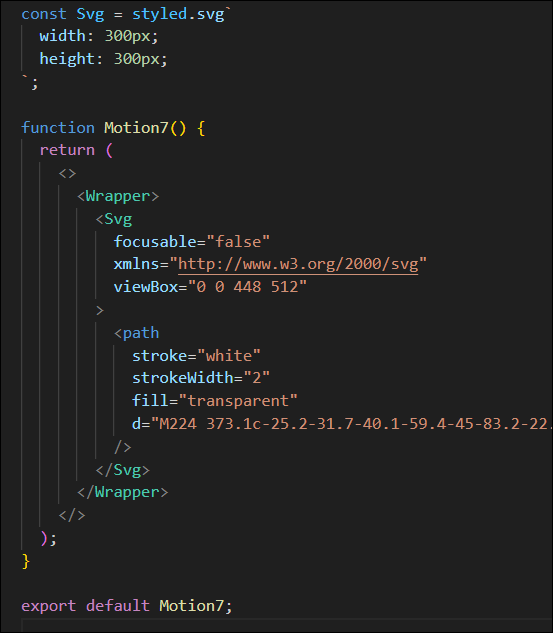

- Svg 스타일 컴포넌트를 만들어 크기를 조정한다.
  - `fill` : svg의 색상
  - `stroke` : svg의 선 색상
  - `strokeWidth` : svg의 선 두께

### fill의 opacity, stroke의 pathLength를 animating

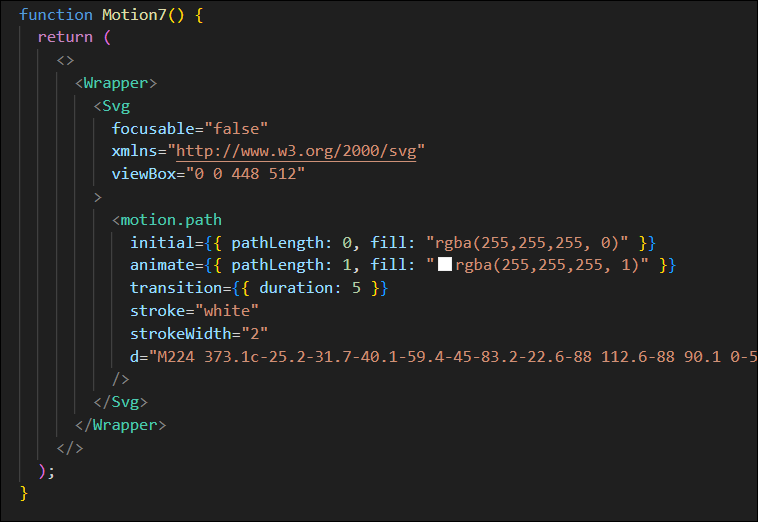

- path태그에 Framer Motion 애니메이션을 주기위해 `motion.path`로 변경한다.
- `initial`과 `animate`의 속성으로 fill을 "rgba(255,255,255, 0)" 에서 "rgba(255,255,255, 1)" 으로 색상이 채워지게한다.
- `initial`과 `animate`의 속성으로 pathLength도 0 에서 1 로 선이 그려지게한다.

### 실행화면


### Variants 사용하기

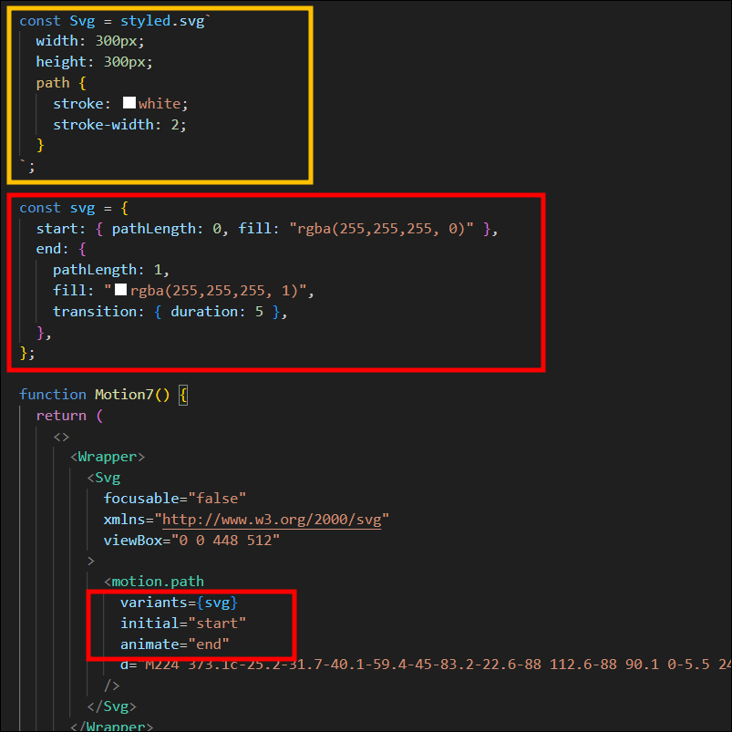

- `<motion.div>`의 style을 Svg 스타일 컴포넌트로 옮겨서 정리해준다.

### 특정 property의 animation duration을 단독으로 변경하는 방법

앞서 pathLength와 fill이 동시에 0에서 1로 5초 동안 채워지는 애니메이션을 구현했다.

먼저 path를 그리고 끝난 후에 fill을 채우는 애니메이션을 구현하기

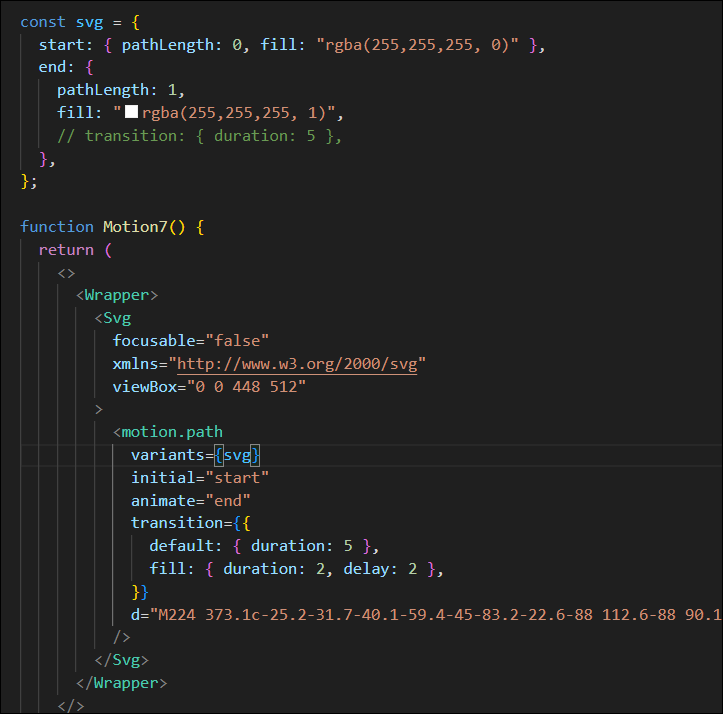

- transition prop 을 사용해 default 값을 쓰면 모든 속성한테 적용되는 값이고, fill 속성은 2초 기다린 다음, 2초동안 animate가 작동하게 만든다.

### 실행화면


