# #3 TYPESCRIPT

## 3.0 Introduction

> ### TypeScript
>
> - JavaScript 를 기반으로 한 프로그래밍 언어
> - JavaScript 와 다른 프로그래밍 언어지만 문법은 거의 같고, 새로운 기능만 추가된다.
> - 언어가 작동하기 전에 type을 확인한다. (프로그램을 돌리기전에 무엇이 잘못되었는지 알려준다.)
> - 컴퓨터는 JavaScript 밖에 이해할 수 없어서 publish전에 JavaScript가 TypeScript로 compile 해준다.
>
> #### 💡 프로그래밍 언어가 작동하기 전에 잘못됐다고 말해주는 보호장치인 TypeScript
>
> [TypeScript 테스트 - Typescript 플레이그라운드](https://www.typescriptlang.org/play)  
> [TypeScript 공식문서](https://create-react-app.dev/docs/adding-typescript)  
> [DefinitelyTyped](https://github.com/DefinitelyTyped/DefinitelyTyped)  
> &nbsp;

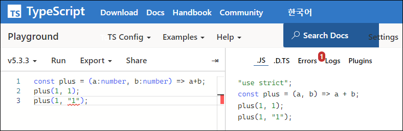

## 3.1 DefinitelyTyped

1. Create React App을 타입스크립트로 시작하기(이게 제일 편함,,,)

   ```
   npx create-react-app my-app --template typescript
   ```

2. 기존 Create React App으로 만든 프로젝트에 타입스크립트 설치

   ```
   npm install --save typescript @types/node @types/react @types/react-dom @types/jest
   ```

   - TypeScript 확장자 변경 `.ts` / React에서 TypeScript 확장자는 `.tsx` ( .js ➡ .tsx )
   - 다음 명령어로 tsconfig.json 파일 생성

     ```bash
     npx tsc --init

     # tsconfig.json 파일 생성 후
     # "compilerOptions": {} 내부에 "jsx": "preserve" 주석해제
     # "compilerOptions": {} 밑에 ,"include": ["src"] 추가
     ```

   - index.tsx 부분 수정

     ```javascript
     const root = ReactDOM.createRoot(
      document.getElementById("root") as HTMLElement
     );
     ```

- @types/styled-components 설치

  🚨 styled-components v6에서는 타입스크립트가 기본으로 탑재되어 있어 따로 설치 안해도 된다.  
  ( styled-components 버전은 package.json 에 나와있다. )

  ```
  npm i --save-dev @types/styled-components
  ```

  > ### @type란?
  >
  > 매우 큰 Github repository, 모든 유명한 npm 라이브러리를 가지고 있는 저장소.  
  > &nbsp;

## 3.2 Typing the Props

> ### interface
>
> : object shape 을 TypeScript 에게 설명해준다.
>
> Prop Types와 매우 유사하지만 다른점이 있다.
>
> - Prop Types 는 코드가 실행된 후 브라우저에서 에러 확인
> - Interface 는 코드가 실행되기 전에 에러 확인  
>   &nbsp;

- interface를 통해 컴포넌트 props에 type을 줄 수 있다.

  1. App.tsx 에서 Circle 컴포넌트 2개를 return 하고 Circle 컴포넌트한테 각각 `bgColor="teal"`,`bgColor="tomato"` props 를 보낸다.
  2. Circle 컴포넌트가 받은 props의 타입이 뭔지 설명해주기위해 `CircleProps interface` 를 만든다.
  3. 이제 return 할 스타일 컴포넌트인 `<Container />` 도 props를 보낼건데 이 props도 타입이 뭔지 설명해주기위해 `ContainerProps interface` 를 만든다.
  4. TypeScript 에게 bgColor가 뭔지 말해줬기 때문에 `${props => props.}` 에서 자동완성 기능으로 완성할 수 있다.

  ### `Circle.tsx`

  ```javascript
  import styled from "styled-components";

  interface ContainerProps {
    bgColor: string;
  }

  const Container =
    styled.div <
    ContainerProps >
    `
    width: 200px;
    height: 200px;
    background-color: ${(props) => props.bgColor};
    border-radius: 100px;
  `;

  interface CircleProps {
    bgColor: string;
  }

  function Circle({ bgColor }: CircleProps) {
    return <Container bgColor={bgColor} />;
  }

  export default Circle;
  ```

  ### `App.tsx`

  ```javascript
  import styled, { keyframes } from "styled-components";
  import Circle from "./Circle";

  function App() {
    return (
      <div>
        <Circle bgColor="teal" />
        <Circle bgColor="tomato" />
      </div>
    );
  }

  export default App;
  ```

## 3.3 Optional Props

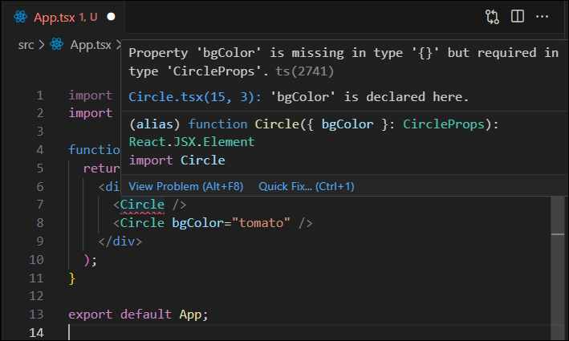

- Circle 컴포넌트의 bgColor가 required이기 때문에, App.tsx의 Circle에 bgColor를 지우면 빨간줄을 치면서 오류를 감지한다.  
  💡 만약 꼭 필요하지 않은 props를 만들고 싶다면?

### 꼭 필요하지 않은 props를 선택적(optional)으로 만들수 있는 방법

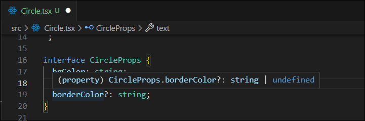

- 위와 같이 `물음표(?)` 를 붙여주면 borderColor 는 없을 수도 있는 optional이 된다.
  - 이제 App.tsx 의 Circle 에는 props에 borderColor 가 없어도 오류가 뜨지 않는다.
- borderColor 는 `string` 또는 `undefined` 중 하나이다.
- 이제 borderColor 를 스타일 컴포넌트`<Container/>` 로 보내줄건데, `<Container/>` 는 아직 borderColor 가 뭔지 모르는 상태이므로 `ContainerProps interface` 에도 적어줘야한다.

  ```javascript
  // Circle.tsx

  interface ContainerProps {
    bgColor: string;
    borderColor: string;
  }

  const Container =
    styled.div <
    ContainerProps >
    `
    width: 200px;
    height: 200px;
    background-color: ${(props) => props.bgColor};
    border-radius: 100px;
    border: 5px solid ${(props) => props.borderColor};
  `;
  ```

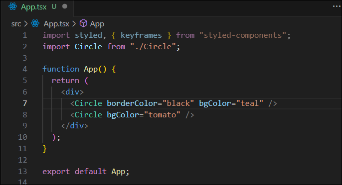
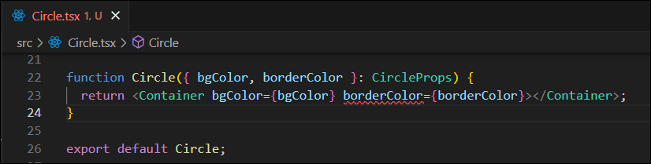

- `ContainerProps interface` 에 borderColor를 추가해줬으나 App.tsx 는 둘중 하나의 컴포넌트만 borderColor 를 props 로 받고 있어서 `<Container/>`컴포넌트는 여전히 오류가 나있는 상태이다.
- 초기값을 주는걸로 해결할 수 있다.

  - undefined된 상태라면 borderColor는 bgColor와 같은 값을 가지게 설정 할 수 있다.
  - `borderColor={borderColor ?? "red"}`을 넣어 초기color를 고정할 수 있다.

  ```javascript
  function Circle({ bgColor, borderColor }: CircleProps) {
    return (
      <Container
        bgColor={bgColor}
        borderColor={borderColor ?? bgColor}
      ></Container>
    );
  }
  ```

> #### 💡 참고
>
> #### ?? [ Null 병합 연산자 (Nullish coalescing operator)]
>
> ?? 앞에 값이 null이거나 undefined이면 오른쪽 값을, 그렇지 않으면 왼쪽 값을 반환하는 논리연산자  
> &nbsp;

### 실행결과

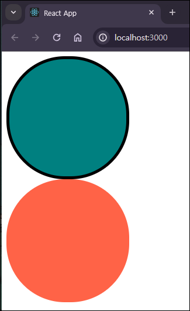

- defalut 값 주는 방법 (TypeScript가 아니라 ES6JS문법이다.)  
   => 만약 text props가 존재하지 않는다면 default text를 표출

  ### `App.tsx`

  ```javascript
  function App() {
    return (
      <div>
        <Circle borderColor="black" bgColor="teal" />
        <Circle text="im here" bgColor="tomato" />
      </div>
    );
  }
  ```

  ### `Circle.tsx`

  ```javascript
  interface CircleProps {
    bgColor: string;
    borderColor?: string;
    text?: string;
  }

  function Circle({
    bgColor,
    borderColor,
    text = "default text",
  }: CircleProps) {
    return (
      <Container bgColor={bgColor} borderColor={borderColor ?? bgColor}>
        {text}
      </Container>
    );
  }
  ```

### 실행결과

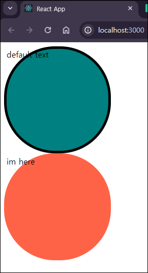

## 3.4 State

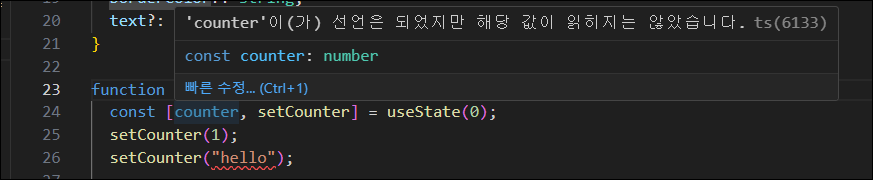

- TypeScript 는 초기값을 기반으로 state의 타입을 추측할 수 있다.
- 위 사진처럼 초기값이 0인 number타입으로 추측되어 string타입("hello")을 보내면 에러 발생

### `꺾쇠 괄호(<>)` 를 통해서 state의 타입을 지정할 수 있다.

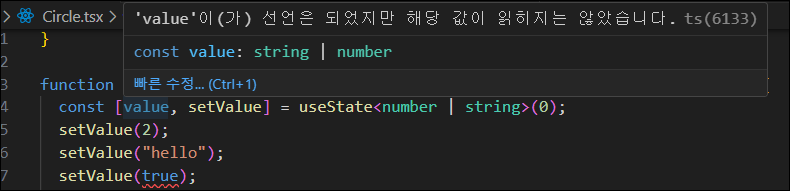

- number, string 타입으로 설정했기때문에 boolean타입(true)을 보내면 에러 발생

> #### 💡 참고
>
> 일반적으로는 초기값을 지정하면 TypeScript 가 자동으로 타입을 유추하기 때문에 굳이 지정해주지 않아도 되지만 상태가 `undefined` 또는 `null` 이 될 수도 있거나 `객체` 또는 `배열` 일때는 지정해주는 것이 좋다.  
> ex) `const [ value, setValue ] = useState< Value | null >(null);`  
> &nbsp;

## 3.5 Forms

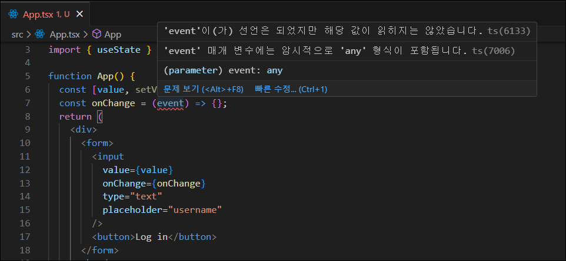

- useState 를 만들어서 input의 value를 state의 value로 할당해준다.
- onChange 함수를 만들어서 input의 onChange 이벤트와 연결해준다.
- onChange 함수에서 원하는 건, event 에 접근!  
  하지만 위 사진처럼 event 는 `any타입`이라 한다.  
  `any타입` 은 TypeScript의 타입이며 무엇이든 될 수 있다는 걸 뜻한다.  
  그러므로 `any타입을 제외하고 무슨 타입인지를 정하거나 설명`해야한다.

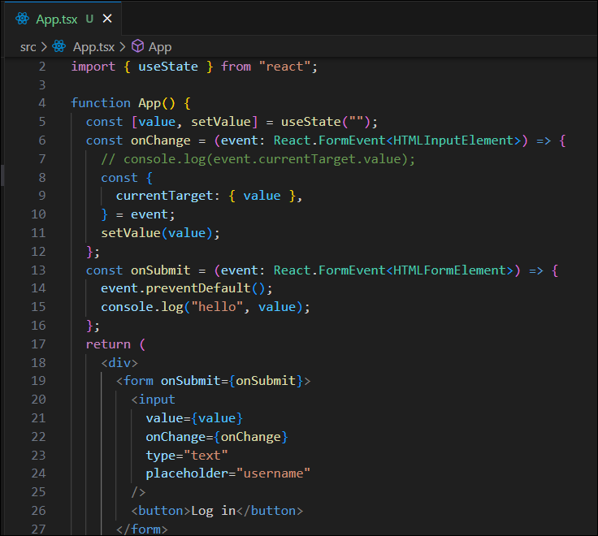

- 위와 같이 매개변수 event의 타입을 정의한다. (위와 같은 TS문법은 혼자 찾아내기 어려우니 문서를 읽거나 구글링)  
  [ 공식문서 - SyntheticEvent (합성 이벤트) ](https://legacy.reactjs.org/docs/events.html)
- `event: React.FormEvent<HTMLInputElement>`  
  : React의 FormEvent 내에서 InputElement 가 onChange 이벤트를 발생시키는 것
- JavaScript 에서는 `event.target.value` 이지만 TypeScript 에서는 `event.currentTarget.value`를 사용한다.

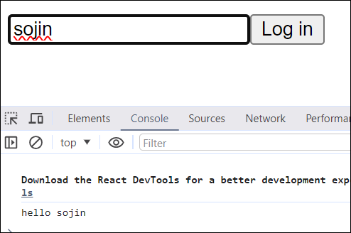

> #### 💡 참고
>
> ```javascript
> const {
>   currentTarget: { value },
> } = event;
> ```
>
> - ES6문법으로 event안 currentTarget안에 value의 값을 기존 이름 그대로 value 라는 변수를 만드는 것이다.
> - `const value = event.currentTarget.value` 와 같다.
> - 저런 형태는 여러개를 쓸때 장점을 발휘한다.
>
>   - currentTarget안에서 value, tagName, width, id 4개를 가져오고 싶다면?
>
>     ```javascript
>     const value = event.currentTarget.value;
>     const tagName = event.currentTarget.tagName;
>     const width = event.currentTarget.width;
>     const id = event.currentTarget.id;
>     // ES6문법으로 정리
>     const {
>       currentTarget: { value, tagName, width, id },
>     } = event;
>     ```

## 3.6 Themes

[styled-components - TypeScript](https://styled-components.com/docs/api#typescript)

### 1. 선언 파일 생성

- src 폴더안에 `styled.d.ts` 파일을 생성한다. (d.ts 는 declaration file 이라는 뜻.)
- 아래 코드를 붙여넣는다.
- `DefaultTheme interface` 안의 내용은 테마가 어떻게 보일지 설명할 부분이다.

  ```javascript
  // import original module declarations
  import 'styled-components';


  // and extend them!
  declare module 'styled-components' {
    export interface DefaultTheme {
      borderRadius: string;


      colors: {
        main: string;
        secondary: string;
      };
    }
  }
  ```

  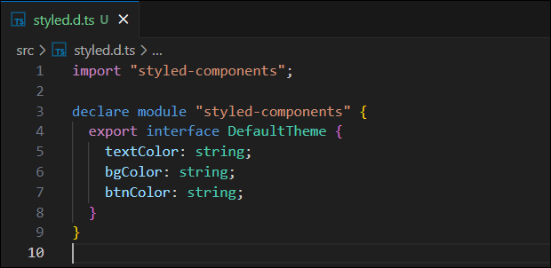

### 2. 테마를 만들 파일 생성

- src 폴더안에 `theme.ts` 파일을 생성한다.
- 라이트모드와 다크모드일때의 배경색, 폰트색, 버튼색을 설정한다.
- DefaultTheme에서는 btnColor 속성이 있기 때문에 위와 같이 btnColor를 속성을 넣지 않으면 TypeScript는 오류를 나타내고 실수를 잡아낼 수 있다.

  

### 3. 만든 테마 적용

- 2에서 만든 테마를 `index.tsx` 에 적용한다.

  ```javascript
  import React from "react";
  import ReactDOM from "react-dom/client";
  import App from "./App";
  import { ThemeProvider } from "styled-components";
  import { darkTheme, lightTheme } from "./theme";

  const root = ReactDOM.createRoot(
    document.getElementById("root") as HTMLElement
  );
  root.render(
    <React.StrictMode>
      <ThemeProvider theme={darkTheme}>
        <App />
      </ThemeProvider>
    </React.StrictMode>
  );
  ```

- `App.tsx` 에서 props 로 받아 사용한다.

  - 자동완성을 지원하므로 오타같은 실수를 방지할 수 있다.

  ```javascript
  import styled from "styled-components";

  const Container = styled.div`
    background-color: ${(props) => props.theme.bgColor};
  `;
  const H1 = styled.h1`
    color: ${(props) => props.theme.textColor};
  `;

  function App() {
    return (
      <Container>
        <H1>Protected</H1>
      </Container>
    );
  }

  export default App;
  ```

### 실행결과

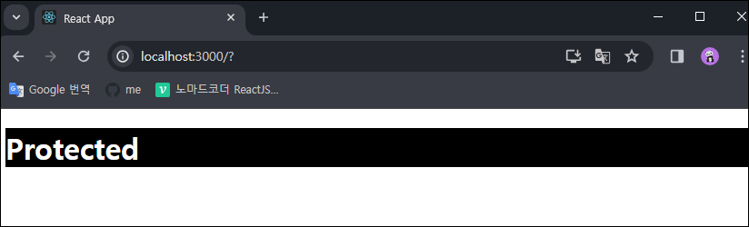
