# #5 CRYPTO TRACKER

#4 는 React router V6을 다루는 내용이므로 추후에 들을 예정이다.  
#5 에서는 V5를 사용한다. 현재(2024.03.09)까지도 V5를 많이 사용하므로 사용해도 아무 문제 없다.  
[NPM - react-router-dom](https://www.npmjs.com/package/react-router-dom?activeTab=versions)

## Setup

```bash
# React-router와 React-query 설치
npm i react-router-dom@5.3.0 react-query

# 타입스크립는 react-router-dom이 뭔지 모르니 같이 설치
npm i --save-dev @types/react-router-dom

# 🚨 설치를 하면 무조건 껐다가 다시 npm start 하자!
```

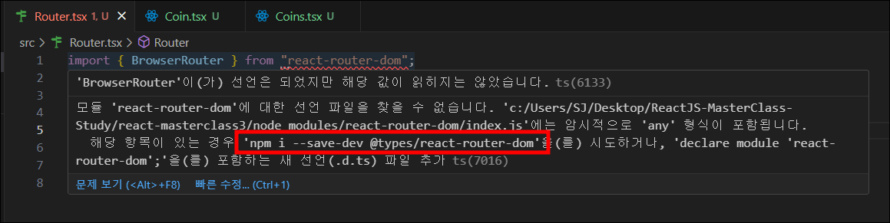

> ### 페이지 라우팅
>
> `/` -> 모든 코인들이 보여지는 페이지  
> `/:id` -> `/btc` -> 특정 코인 상세정보 페이지  
> &nbsp;

1. `src` 폴더 안에 `routes` 폴더 생성 후 첫번째 페이지인 `Coins.tsx` 파일과 특정 코인 상세정보 페이지인 `Coin.tsx` 파일을 생성한다.
2. `src` 폴더 안에 `Router.tsx` 파일을 생성해서 다음과 같이 react-router-dom을 설정해준다.

   ```javascript
   // Router.tsx

   import { BrowserRouter, Route, Switch } from "react-router-dom";
   import Coins from "./routes/Coins";
   import Coin from "./routes/Coin";

   function Router() {
     return (
       <BrowserRouter>
         <Switch>
           <Route path="/:coinId">
             <Coin />
           </Route>
           <Route path="/">
             <Coins />
           </Route>
         </Switch>
       </BrowserRouter>
     );
   }

   export default Router;
   ```

3. `App.tsx`에 아래와 같이 Router를 렌더링 해준다.

   ```javascript
   // App.tsx

   import Router from "./Router";

   function App() {
     return <Router></Router>;
   }

   export default App;
   ```

4. `Coin.tsx` 파일에서 URL의 파라미터 부분을 잡아내기 위해서 `useParams()`를 사용한다.  
   하지만 타입스크립트는 `useParams()`를 빈 오브젝트라고 생각해 오류가 발생한다.
5. 타입스크립트에게 알려주기위해 `RouteParams interface` 을 생성한다.  
   `const {coinId} = useParams<{coinId:string}>();`로 대체 가능하다.

   ```javascript
   // Coin.tsx

   import { useParams } from "react-router-dom";

   interface RouteParams {
     coinId: string;
   }

   function Coin() {
     // const params = useParams();
     // console.log(params);
     const { coinId } = useParams<RouteParams>();

     return <h1>Coin: {coinId}</h1>;
   }

   export default Coin;
   ```

    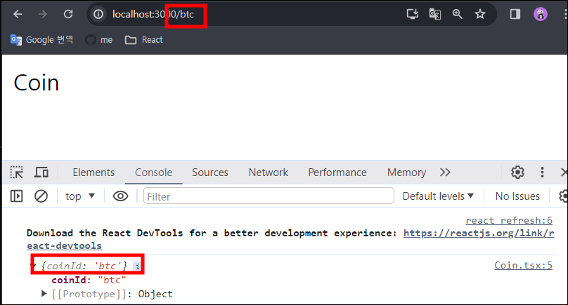

## Styles

> - [NPM - styled-reset](https://www.npmjs.com/package/styled-reset)
> - [Reset CSS](https://cssdeck.com/blog/scripts/eric-meyer-reset-css/)
> - [GoogleFonts](https://fonts.google.com/?preview.text=Almost%20before%20we%20knew%20it,%20we%20had%20left%20the%20ground.&query=source)
> - [Colors Palette](https://flatuicolors.com/palette/gb)

💡 `import { Reset } from 'styled-reset'`을 설치해 `<Reset />` 컴포넌트를 사용하는 방법도 있지만 `Reset CSS` 를 이용해 전체 document에 적용한다.

```javascript
// App.tsx

import { createGlobalStyle } from "styled-components";
import Router from "./Router";

const GlobalStyle = createGlobalStyle`
 `;

function App() {
  return (
    <>
      <GlobalStyle></GlobalStyle>
      <Router></Router>
    </>
  );
}

export default App;
```

- styled-components는 전체 document에 적용할 수 있는 `createGlobalStyle` 이란 프로퍼티가 있다.
- `<GlobalStyle/>`컴포넌트는 렌더링 될때, 전역 스코프에 스타일을 적용시켜준다.
- `<></> : Franment` 유령 컴포넌트는 2개이상의 컴포넌트를 리턴해야할때 `<div>` 태그의 낭비를 줄여준다.

```javascript
import { createGlobalStyle } from "styled-components";
import Router from "./Router";

const GlobalStyle = createGlobalStyle`
html, body, div, span, applet, object, iframe,
h1, h2, h3, h4, h5, h6, p, blockquote, pre,
a, abbr, acronym, address, big, cite, code,
del, dfn, em, img, ins, kbd, q, s, samp,
small, strike, strong, sub, sup, tt, var,
b, u, i, center,
dl, dt, dd, ol, ul, li,
fieldset, form, label, legend,
table, caption, tbody, tfoot, thead, tr, th, td,
article, aside, canvas, details, embed,
figure, figcaption, footer, header, hgroup,
menu, nav, output, ruby, section, summary,
time, mark, audio, video {
  margin: 0;
	padding: 0;
	border: 0;
	font-size: 100%;
	font: inherit;
	vertical-align: baseline;
}
/* HTML5 display-role reset for older browsers */
article, aside, details, figcaption, figure,
footer, header, hgroup, menu, nav, section {
  display: block;
}
body {
  line-height: 1;
}
ol, ul {
  list-style: none;
}
blockquote, q {
  quotes: none;
}
blockquote:before, blockquote:after,
q:before, q:after {
  content: '';
	content: none;
}
table {
  border-collapse: collapse;
	border-spacing: 0;
}
 `;

function App() {
  return (
    <>
      <GlobalStyle></GlobalStyle>
      <Router></Router>
    </>
  );
}

export default App;
```

- 위와 같이 `Reset CSS` 파일을 붙여 넣어주면 브라우저의 기본값이 변경된다.
- 구글폰트, theme 도 설정해준다.

#### ⚠ 경고발생

`createGlobalStyle`에서 @import CSS 구문 사용 경고

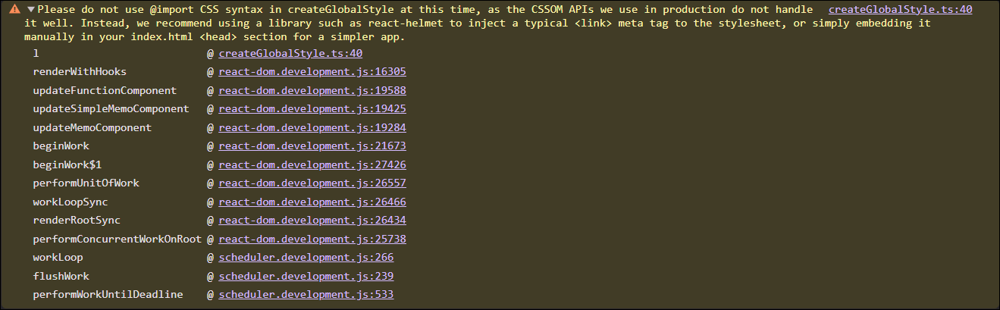

#### ✅ 해결방법

React-helmet과 같은 라이브러리를 사용하여 일반적인 `<link>` 메타 태그를 스타일시트에 삽입하거나, index.html `<head>` 섹션에 수동으로 삽입하는 것이 좋다.

## Home part One

### 코인목록 페이지 만들기

```javascript
// Coins.tsx

import { useEffect, useState } from "react";
import { Link } from "react-router-dom";
import styled from "styled-components";

const Container = styled.div`
  padding: 0 20px;
  max-width: 480px;
  margin: 0 auto;
`;

const Header = styled.header`
  height: 10vh;
  display: flex;
  justify-content: center;
  align-items: center;
  margin: 15px 0;
`;

const CoinsList = styled.ul``;

const Coin = styled.li`
  background-color: white;
  color: ${(props) => props.theme.bgColor};
  border-radius: 15px;
  margin-bottom: 10px;
  a {
    padding: 20px;
    transition: color 0.2s ease-in;
    display: block;
  }
  &:hover {
    a {
      color: ${(props) => props.theme.accentColor};
    }
  }
`;

const Title = styled.h1`
  font-size: 48px;
  color: ${(props) => props.theme.accentColor};
`;

const coins = [
  {
    id: "btc-bitcoin",
    name: "Bitcoin",
    symbol: "BTC",
    rank: 1,
    is_new: false,
    is_active: true,
    type: "coin",
  },
  {
    id: "eth-ethereum",
    name: "Ethereum",
    symbol: "ETH",
    rank: 2,
    is_new: false,
    is_active: true,
    type: "coin",
  },
  {
    id: "hex-hex",
    name: "HEX",
    symbol: "HEX",
    rank: 3,
    is_new: false,
    is_active: true,
    type: "token",
  },
];

function Coins() {
  return (
    <Container>
      <Header>
        <Title>코인</Title>
      </Header>
      <CoinList>
        {coins.map((coin) => (
          <Coin key={coin.id}>
            <Link to={`/${coin.id}`}>{coin.name} &rarr;</Link>
          </Coin>
        ))}
      </CoinList>
    </Container>
  );
}

export default Coins;
```

1. 프론트 작업을 위해 api의 일부분만 가져와 map함수로 li태그를 매핑해준다.
2. 일반 `<a>` 태그는 새로고침이 되어버리기 때문에 react-router-dom의 `Link` 컴포넌트를 사용한다.

#### 🚨 문제발생

메뉴를 선택하면 URL만 바뀌고 렌더링이 바뀌지 않는다.

#### ✅ 해결방법

`index.tsx` 파일에서 `<React.StrictMode>` 이 부분을 주석해놨다.

```javascript
import React from "react";
import ReactDOM from "react-dom/client";
import App from "./App";
import { ThemeProvider } from "styled-components";
import { theme } from "./theme";

const root = ReactDOM.createRoot(
  document.getElementById("root") as HTMLElement
);
root.render(
  //<React.StrictMode>
    <ThemeProvider theme={theme}>
      <App />
    </ThemeProvider>
  //</React.StrictMode>
);

```

### 실행결과

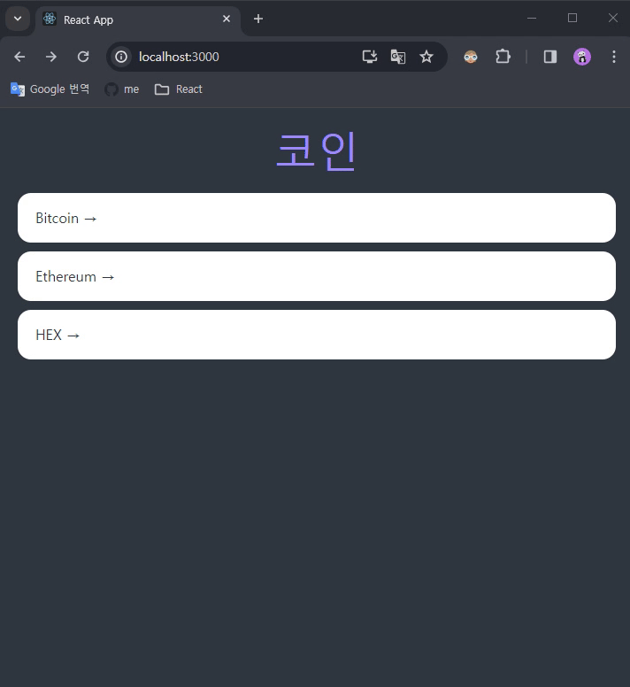

## Home part Two

### 코인목록 페이지에 코인API 데이터 불러오기

> ### coinpaprika API
>
> https://api.coinpaprika.com/#tag/Coins/paths/~1coins~1%7Bcoin_id%7D~1ohlcv~1latest~1/get  
> &nbsp;

```javascript
// Coins.tsx

import { useEffect, useState } from "react";
import { Link } from "react-router-dom";
import styled from "styled-components";

const Container = styled.div`
  padding: 0 20px;
  max-width: 480px;
  margin: 0 auto;
`;

const Header = styled.header`
  height: 10vh;
  display: flex;
  justify-content: center;
  align-items: center;
  margin: 15px 0;
`;

const CoinsList = styled.ul``;

const Coin = styled.li`
  background-color: white;
  color: ${(props) => props.theme.bgColor};
  border-radius: 15px;
  margin-bottom: 10px;
  a {
    padding: 20px;
    transition: color 0.2s ease-in;
    display: block;
  }
  &:hover {
    a {
      color: ${(props) => props.theme.accentColor};
    }
  }
`;

const Title = styled.h1`
  font-size: 48px;
  color: ${(props) => props.theme.accentColor};
`;

const Loader = styled.span`
  text-align: center;
  display: block;
`;

interface CoinInterface {
  id: string;
  name: string;
  symbol: string;
  rank: number;
  is_new: boolean;
  is_active: boolean;
  type: string;
}

function Coins() {
  const [coins, setCoins] = useState<CoinInterface[]>([]);
  const [loading, setLoading] = useState(true);
  useEffect(() => {
    (async () => {
      const response = await fetch("https://api.coinpaprika.com/v1/coins");
      const json = await response.json();
      console.log(json);
      setCoins(json.slice(0, 100));
      setLoading(false);
    })();
  }, []);
  console.log(coins);
  return (
    <Container>
      <Header>
        <Title>코인</Title>
      </Header>
      {loading ? (
        <Loader>Loading...</Loader>
      ) : (
        <CoinsList>
          {coins.map((coin) => (
            <Coin key={coin.id}>
              <Link to={`/${coin.id}`}>{coin.name} &rarr;</Link>
            </Coin>
          ))}
        </CoinsList>
      )}
    </Container>
  );
}

export default Coins;
```

1. 데이터를 가져오기 전에, 데이터의 interface를 생성해준다.  
   (원래 데이터의 모습을 바탕으로 interface를 만든다.)
2. 초기값이 빈 배열인 `useState()`를 생성한 후 타입스크립트에게 interface를 이용해 coins State는 coins로 이루어진 array 라고 알려준다.
3. `useEffect()`를 이용해 API 데이터를 불러온다.
   ```javascript
   useEffect(() => {
     (() => console.log(1))();
   }, []);
   ```
   - 이런 형태의 useEffect() 를 만들면 바로 function을 execute(실행)할 수 있다.
4. 너무 많은 데이터는 필요없으므로 100개 정도만 받아오기위해 `slice(0, 100)` 으로 잘라준다.

   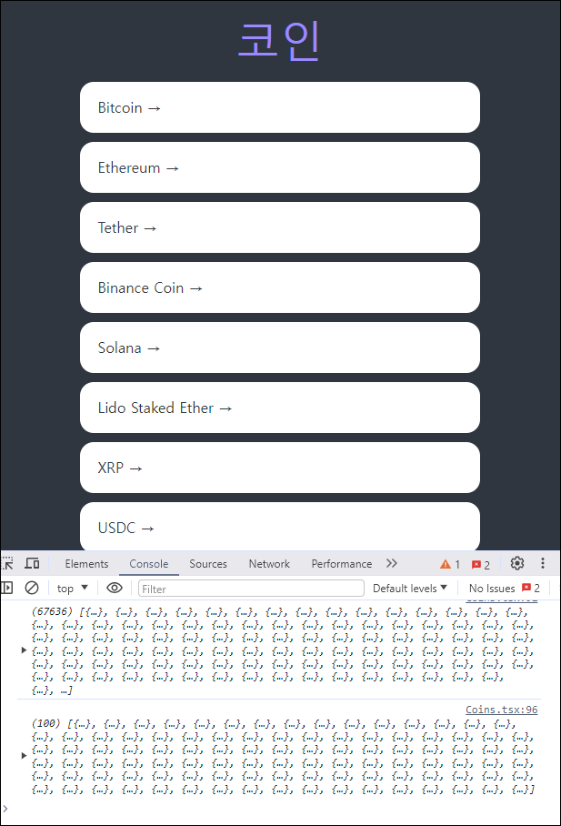

5. `loading State`를 생성해 `true 일땐 "Loading..." 문구`를 보여주고 `false 일땐 코인리스트`가 보이도록 만든다. (추후 react-query로 loading 컴포넌트를 만들어줄 예정)

## Route States

> ### 암호화폐 아이콘 API
>
> #### Examples
>
> - `https://coinicons-api.vercel.app/api/icon/btc`
> - `https://coinicons-api.vercel.app/api/icon/yfi`
>
> #### Contribute
>
> Add 128x128 transparent png images in a PR in our repo: https://github.com/serranoarevalo/cryptoicon-api  
> &nbsp;

### API 를 통해 코인목록 페이지의 코인아이콘 불러오기

```javascript
// Coins.tsx

import { useEffect, useState } from "react";
import { Link } from "react-router-dom";
import styled from "styled-components";

...

const Img = styled.img`
  width: 35px;
  height: 35px;
  margin-right: 10px;
`;

function Coins() {
  const [coins, setCoins] = useState<CoinInterface[]>([]);
  const [loading, setLoading] = useState(true);
  useEffect(() => {
    (async () => {
      const response = await fetch("https://api.coinpaprika.com/v1/coins");
      const json = await response.json();
      console.log(json);
      setCoins(json.slice(0, 100));
      setLoading(false);
    })();
  }, []);
  console.log(coins);
  return (
    <Container>
      <Header>
        <Title>코인</Title>
      </Header>
      {loading ? (
        <Loader>Loading...</Loader>
      ) : (
        <CoinsList>
          {coins.map((coin) => (
            <Coin key={coin.id}>
              <Link
                to={{
                  pathname: `/${coin.id}`,
                  state: { name: coin.name },
                }}
              >
                
                {coin.name} &rarr;
              </Link>
            </Coin>
          ))}
        </CoinsList>
      )}
    </Container>
  );
}

export default Coins;
```

- `` 스타일 컴포넌트를 생성해서 src에 `코인아이콘 API`를 써주고 각각의 코인아이콘을 불러올 수 있게 `coin.symbol.toLowerCase()` 을 써준다.
- `https://static.coinpaprika.com/coin/${coin.id}/logo.png` 이 url을 사용하면 빠진 이미지 없이 불러올 수 있다.

### 코인 상세정보 페이지 만들기

코인목록 페이지(`Coins.tsx`)에서 API를 불러 데이터를 받아 코인상세정보 페이지(`Coin.tsx`)로 이동하면 parameter를 이용해 url로 `coinId`를 전달하고 있다.  
이렇게되면 코인상세정보 페이지에서도 API를 불러오게 되므로 로딩화면이 지연될 수 있다.

#### 이를 해결하기 위해 url로 정보를 넘기는 것이 아닌 `State`를 사용해 정보를 넘기자!

```javascript
// Coins.tsx

<CoinsList>
  {coins.map((coin) => (
    <Coin key={coin.id}>
      <Link
        to={{
          pathname: `/${coin.id}`,
          state: { name: coin.name },
        }}
      >
        
        {coin.name} &rarr;
      </Link>
    </Coin>
  ))}
</CoinsList>
```

- react-router-dom인 `<Link/>` 컴포넌트를 이용해 object형식의 state를 코인상세정보 페이지로 넘겨준다.

```javascript
// Coin.tsx

import { useState } from "react";
import { useLocation, useParams } from "react-router-dom";
import styled from "styled-components";

const Container = styled.div`
  padding: 0 20px;
  max-width: 480px;
  margin: 0 auto;
`;

const Header = styled.header`
  height: 10vh;
  display: flex;
  justify-content: center;
  align-items: center;
  margin: 15px 0;
`;

const Title = styled.h1`
  font-size: 48px;
  color: ${(props) => props.theme.accentColor};
`;

const Loader = styled.span`
  text-align: center;
  display: block;
`;
interface RouteParams {
  coinId: string;
}

interface RouteState {
  name: string;
}

function Coin() {
  const [loading, setLoading] = useState(true);
  const { coinId } = useParams<RouteParams>();
  const { state } = useLocation<RouteState>();

  return (
    <Container>
      <Header>
        <Title>{state?.name || "Loading..."}</Title>
      </Header>
      {loading ? <Loader>Loading...</Loader> : null}
    </Container>
  );
}

export default Coin;
```

- 코인상세정보 페이지는 `useLocation()` 으로 state를 받는다.

#### 🚨 문제발생

코인목록 페이지에서 코인상세정보 페이지 이동이 아닌 코인상세정보 페이지 url로 바로 접속하면 아래와 같은 오류가 발생한다.  
이유는 State는 `Location`으로 받아오기 때문이다.

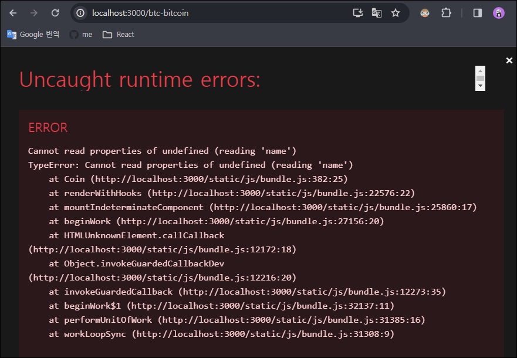

#### ✅ 해결방법

`state?.name || "Loading..."` 로 state의 name이 있으면 name을 보여주고 없으면 "Loading..." 문구를 출력해 State를 받아오지 못하는 경우도 만들어준다.

### 실행결과

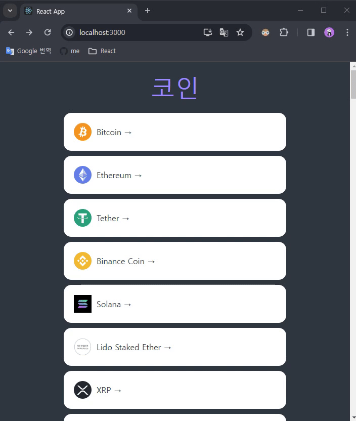

## Coin Data

### 코인상세정보 페이지에 코인정보, 코인가격정보 API 데이터 불러오기

coin에 대한 정보 : `https://api.coinpaprika.com/v1/coins/btc-bitcoin`  
coin의 가격 정보 : `https://api.coinpaprika.com/v1/tickers/btc-bitcoin`

URL 끝에는 `코인ID`를 넣어야되는데 앞서 `useParams()`로 갖고온 `coinId`를 사용한다.

```javascript
//coin.tsx

function Coin() {
  const [loading, setLoading] = useState(true);
  const { coinId } = useParams<Routeparams>();
  const { state } = useLocation<RouteState>();
  useEffect(() => {
    (async () => {
      const infoData = await (
        await fetch(`https://api.coinpaprika.com/v1/coins/${coinId}`)
      ).json();
      console.log(infoData);
      const priceData = await (
        await fetch(`https://api.coinpaprika.com/v1/tickers/${coinId}`)
      ).json();
      console.log(priceData);
      setInfo(infoData);
      setPriceInfo(priceData);
    })();
  }, []);
  return (
    <Container>
      <Header>
        <Title>{state?.name || "Loading..."}</Title>
      </Header>
      {loading ? <Loader>"Loading..."</Loader> : null}
    </Container>
  );
}

export default Coin;
```

- API 데이터 불러오기는 한번만 실행되도록 `useEffect()` 사용
- 즉시 실행될 function 생성

  ```javascript
  useEffect(() => {
    ()();
  }, []);
  ```

- `response`와 `json` 2개 변수를 한줄로 만들어서 캡슐화한다.

  ```javascript
  const response = await fetch(
    `https://api.coinpaprika.com/v1/coins/${coinId}`
  );
  const json = await response.json();
  console.log(json);

  // 캡슐화
  const infoData = await (
    await fetch(`https://api.coinpaprika.com/v1/coins/${coinId}`)
  ).json();
  ```

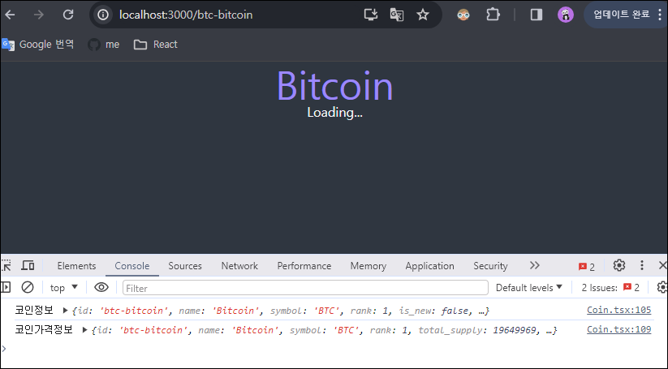

- `infoData`와 `priceData` 데이터 출력되는지 콘솔창에서 확인 후 각각 `useState()`를 만들어 `set수정함수`에 넣어준다.

## Data Types

앞서 만들어준 `useState()`의 state `info`와 `priceInfo`는 타입스크립트가 빈 Object라고 생각한다.

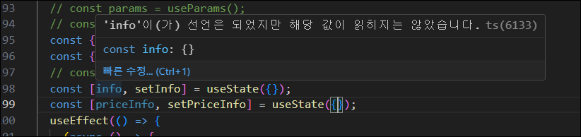

### interface를 통해 타입스크립트에게 데이터 정의하기

※ 대부분의 상황에서는 API의 타입에 대한 정보를 자동생성 할 수 있다고 한다.

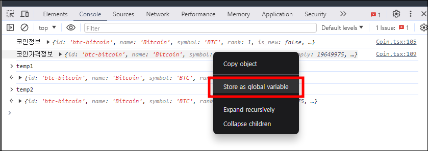

- `console.log()`로 콘솔창에서 출력되는 데이터의 오른쪽 마우스를 눌러서 나오는 `Store as global variable`을 클릭하면 object데이터가 `temp1`에 저장된다.  
  => `temp1`을 통해 `infoData`에 접근 가능
- 위와 같은 방법으로 `priceInfo`도 `temp2`에 저장한다.
- `info`와 `priceInfo`의 `interface`를 만든다.

  ```javascript
  interface InfoData {}

  interface PriceData {}
  ```

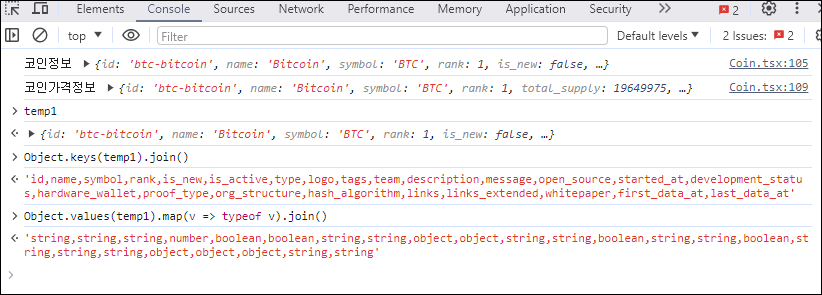

- 콘솔창에서 `Object.keys(temp1).join()`을 사용하여 `temp1`의 key값들을 출력한다.
- value값들의 type은 `Object.values(temp1).map(v => typeof v).join()`을 사용하여 `temp1`의 value값 type을 출력한다.
- `interface InfoData`가 정의 되었으면 위와 같은 방법으로 `interface PriceData` 도 정의해준다.
- 한가지 문제점은 데이터의 타입이 `array` 인것도 `object`로 정의 되기 때문에 이 부분은 따로 interface를 만들어 정의해 줘야한다.

  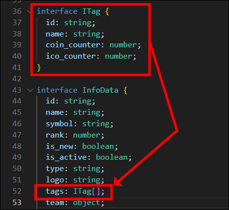

> ## JSON데이터를 타입스크립트 타입으로 빠르게 변환하는 사이트
>
> [quicktype 사이트](https://app.quicktype.io/?l=ts)
>
> ## VScode 단축키
>
> - `Ctrl + Shift + D` : 같은 문자열 선택 (원래는 `Ctrl + D`로 내가 사용하는 키맵과 겹쳐 Custom)
> - `Shift + Alt + i` : 선택한 모든 문자열에 가장 우측 끝으로 포커싱  
>   &nbsp;

## Nested Routes part One

> ### Nested router(중첩라우터)
>
> route안에 있는 또 다른 route이다.  
> 웹사이트에서 탭을 사용할때나 스크린 안에 많은 섹션이 나뉘어진 곳에서 유용하게 쓰인다.
>
> ex)  
> `/btc/price`  
> `/btc/chart`  
> &nbsp;

### 코인상세정보 페이지에 스타일 컴포넌트로 화면 만들고 2개의 Nested Router 생성

```javascript
// Coin.tsx

... 생략

const Overview = styled.div`
  display: flex;
  justify-content: space-between;
  background-color: rgba(0, 0, 0, 0.5);
  padding: 10px 20px;
  border-radius: 10px;
`;
const OverviewItem = styled.div`
  display: flex;
  flex-direction: column;
  align-items: center;
  span:first-child {
    font-size: 10px;
    font-weight: 400;
    text-transform: uppercase;
    margin-bottom: 5px;
  }
`;
const Description = styled.p`
  margin: 20px 0px;
`;

function Coin() {

  ...생략

  return (
    <Container>
      <Header>
        <Title>
          {state?.name ? state.name : loading ? "Loading..." : info?.name}
        </Title>
      </Header>
      {loading ? (
        <Loader>Loading...</Loader>
      ) : (
        <>
          <Overview>
            <OverviewItem>
              <span>Rank:</span>
              <span>{info?.rank}</span>
            </OverviewItem>
            <OverviewItem>
              <span>Symbol:</span>
              <span>${info?.symbol}</span>
            </OverviewItem>
            <OverviewItem>
              <span>Open Source:</span>
              <span>{info?.open_source ? "Yes" : "No"}</span>
            </OverviewItem>
          </Overview>
          <Description>{info?.description}</Description>
          <Overview>
            <OverviewItem>
              <span>Total Suply:</span>
              <span>{priceInfo?.total_supply}</span>
            </OverviewItem>
            <OverviewItem>
              <span>Max Supply:</span>
              <span>{priceInfo?.max_supply}</span>
            </OverviewItem>
          </Overview>

          <Switch>
            <Route path={`/${coinId}/price`}>
              <Price />
            </Route>
            <Route path={`/${coinId}/chart`}>
              <Chart />
            </Route>
          </Switch>
        </>
      )}
    </Container>
  );
}
```

```javascript
// Price.tsx

function Price() {
  return <h1>Price</h1>;
}

export default Price;
```

```javascript
// Chart.tsx

function Chart() {
  return <h1>Chart</h1>;
}

export default Chart;
```

- `<Title>` 에서 state는 홈페이지(코인목록)에서 코인을 클릭할때만 생기는 state이므로 있으면 `state.name` 을 보여주고 없으면 `loading 중일때 "Loading..." 문구를 출력`하고 `loading 중이 아니라면 API로부터 받아온 name(info?.name)`을 출력한다.
- `loading ? "Loading..." : info?.name` 이 부분은 홈페이지(코인목록)로부터 온게 아닌 경우에 실행된다. (주소창에 코인상세정보 페이지 URL을 바로 검색했을 경우)
- routes 폴더안에 `Price.tsx`와 `Chart.tsx` 파일을 생성한다.
- react-router-dom 인 `Switch`와 `Route`로 `Nested router(중첩라우터)`를 만들고 안에 `<Price />`컴포넌트와 `<Chart />`컴포넌트를 렌더링 되게 만든다.

### 실행결과

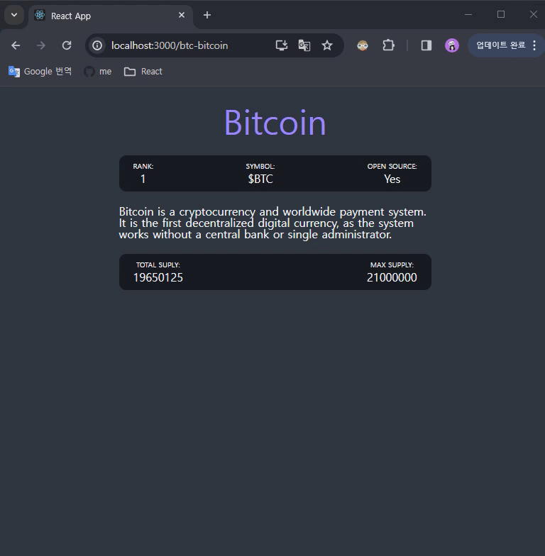

## Nested Routes part Two

### chart와 price 탭메뉴 만들기

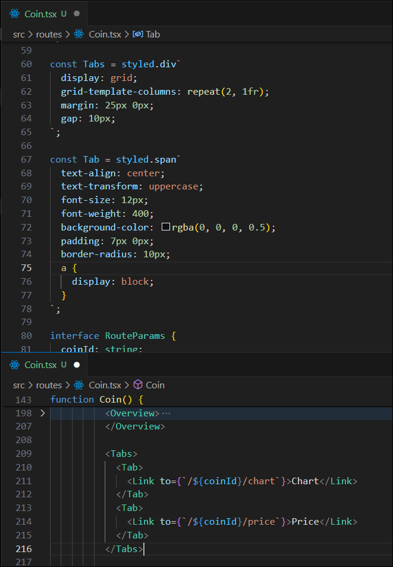

- `<Link>`컴포넌트로 2개의 탭을 만든다.
- `<Tabs>`와 `<Tab>` 스타일 컴포넌트를 만들어 `<Link>`를 감싸준다.

- `useRouteMatch()` 훅을 이용해 선택한 url에 접속했을때 정보를 오브젝트로 넘겨받을 수 있다.

  ```javascript
  const priceMatch = useRouteMatch("/:coinId/price");
  const chartMatch = useRouteMatch("/:coinId/chart");
  console.log(chartMatch);
  console.log(priceMatch);
  ```

  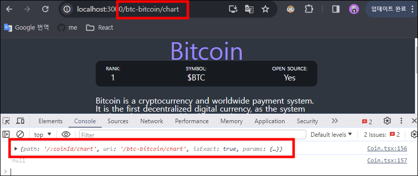

- `<Tab>`컴포넌트에 isActive 라는 prop을 가지게 하고 boolean 형태로 만든다.
- isActive를 priceMatch 나 chartMatch에서 받아오는데 만약 priceMatch 나 chartMatch가 null 이 아니라면(선택한 URL에 들어와있다면) true가 되고 선택한 탭은 accentColor로 변경된다.

  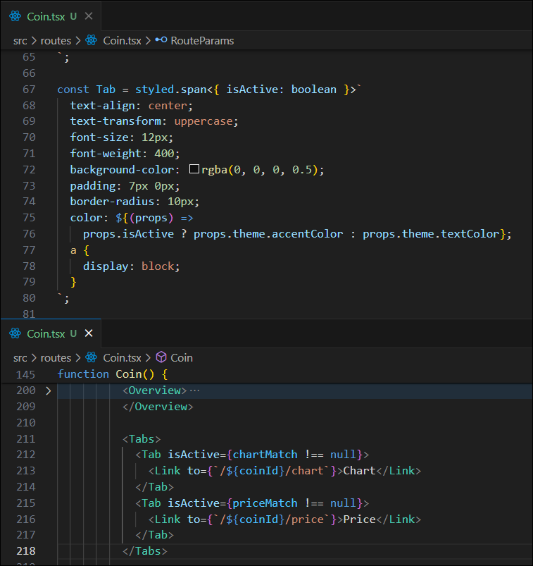

#### 🚨 문제발생

React does not recognize the `isActive` prop on a DOM element 경고

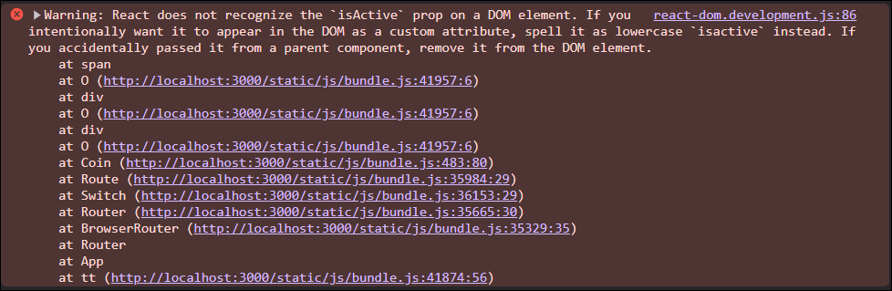

#### ✅ 해결방법

isActive를 `isactive`나 `$isActive`로 변경

[ 이유 ]  
React18 이후 일관성을 높이고, 사용자 혼동을 방지하기 위해 prop의 이름은 `소문자`나 앞에 `$`가 있어야만 사용자 지정 속성으로 인식한다.  
`$`가 추가된 이유는 일부 라이브러리 또는 구성 요소는 대문자를 사용하는 prop을 요구하기 때문이다.

### 실행결과

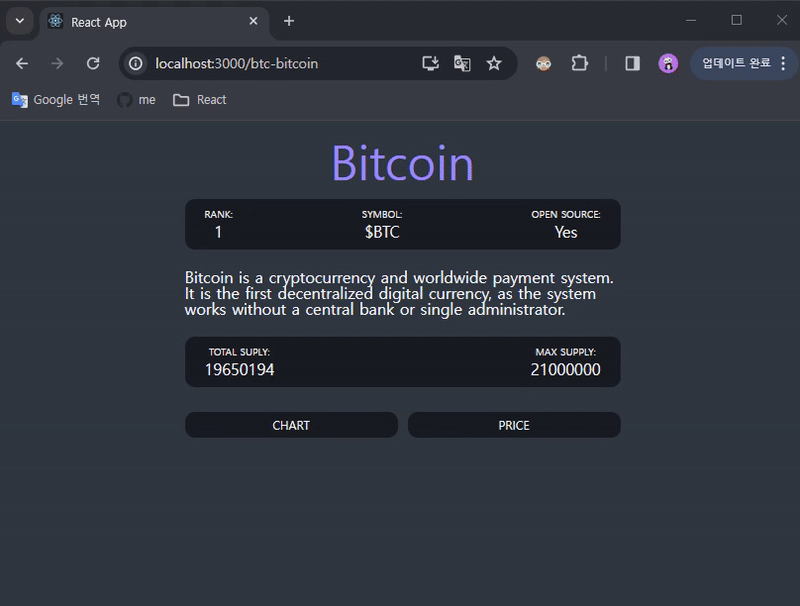
