# #5 CRYPTO TRACKER

## 5.9 React Query part One

React Query는 데이터 Fetching, Caching, 동기화, 서버 데이터 업데이트 등을 쉽게 만들어 주는 라이브러리이다.

### React Query

```javascript
const [loading, setLoading] = useState(true);
const [coins, setCoins] = useState<CoinInterface[]>([]);
useEffect(() => {
  (async () => {
    const response = await fetch("https://api.coinpaprika.com/v1/coins");
    const json = await response.json();
    setCoins(json.slice(0, 100));
    setLoading(false);
  })();
}, []);
```

위의 `loading`과 `coins`는 각각 로딩과 데이터를 위한 state이다.  
그리고 데이터가 준비되면 데이터를 state에 넣고 로딩은 false 넣는 과정을 진행해왔다.  
react query는 이 모든 과정을 축약해 줄 수 있다.

### react-query 설치 및 설정

[react-query 설치](https://tanstack.com/query/v3/docs/framework/react/installation)

```bash
# 17버전
npm i react-query

# 18버전
npm i @tanstack/react-query

# react 버전이 18이면 타입스크립트에서 react query를 못 불러오기 때문에 18버전으로 설치해야한다.
```

[react-query 빠른시작](https://tanstack.com/query/v3/docs/framework/react/quick-start)

```javascript
// index.tsx

... 생략

import { QueryClient, QueryClientProvider } from "react-query";

// queryClient 만들기
const queryClient = new QueryClient();

const root = ReactDOM.createRoot(
  document.getElementById("root") as HTMLElement
);
root.render(
  // provider 만들기 (QueryClientProvider안에 있는 모든 것은 queryClient에 접근 가능)
  <QueryClientProvider client={queryClient}>
    <ThemeProvider theme={theme}>
      <App />
    </ThemeProvider>
  </QueryClientProvider>
);
```

### 코인목록 페이지 React Query - `Coins.tsx`

1.  fetcher 함수 만들기

    ```javascript
    // api.ts

    export function fetchCoin() {
      return fetch("API URL").then((response) => response.json());
    }
    ```

    - `src/api.ts` 파일 생성하기 (API는 따로 관리하는게 좋다.)
    - fetcher 함수는 꼭 `fetch promise` 를 `return` 해줘야한다. (await / async 대신 promise를 사용)

2.  `useQuery()`를 사용해 만들어둔 fetcher 함수 가져오기

    ```javascript
    function Coins() {
      const { isLoading, data } = useQuery<ICoin[]>({
        queryKey: ["allCoins"],
        queryFn: fetchCoins,
      });
      return (
        <Container>
          ...생략
          {isLoading ? (
            <Loader>Loading...</Loader>
          ) : (
            <CoinsList>
              {data?.slice(0, 100).map((coin) => (
                <Coin key={coin.id}>
                  <Link
                    to={{
                      pathname: `/${coin.id}`,
                      state: { name: coin.name },
                    }}
                  >
                    
                    {coin.name} &rarr;
                  </Link>
                </Coin>
              ))}
            </CoinsList>
          )}
        </Container>
      );
    }
    ```

    - `useQuery()`는 2개의 argument가 필요하다.
    - 첫번째는 `query key`이며 우리 query의 고유식별자이다.
    - 두번째는 `fetcher 함수` 이다.
    - `{ }` 안에는 useQuery hook이 fetcher 함수를 불러오고 return 하는 것들이 들어간다.
      - fetcher 함수가 loading 중이라면 `isLoading`에서 boolean 값으로 알려주고, fetcher 함수가 끝나면 json 값을 `data`에 넣는다.
    - 원래 리턴되던 loading state를 useQuery에서 오는 `isLoading`으로 변경하고, coins state를 `data`로 변경한다.  
      하지만 타입스크립트는 `data` 가 뭔지 몰라 다음과 같이 오류를 나타낸다.

      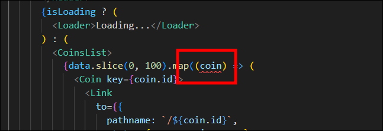

    - useQuery 뒤에 만들어놨던 interface(`<ICoin[]>`)를 붙여준다.
    - interface로 정의해주면 타입스크립트는 `data`가 ICoin array 거나 undefined 인걸 알게된다.  
      그러므로 `data` 뒤에 `물음표(?)`를 붙여준다.

    > ### 💡 참고
    >
    > [@tanstack/react-query - 사용법](https://tanstack.com/query/latest/docs/framework/react/overview)
    >
    > `@tanstack/react-query` 사용시 강의와 달리 `queryKey`와 `queryFn`을 정해주어서 작성해야한다.  
    > 3번째 매개변수로 옵션을 설정할 수 있는데, `select`를 통해서 받아온 데이터를 filter된 데이터를 보내줄 수 있다.
    >
    > ```javascript
    > const { isLoading, error, data } = useQuery({
    >   queryKey: ["allCoins"],
    >   queryFn: fetchCoins,
    > });
    > ```
    >
    > &nbsp;

### 실행결과

react query 사용전에는 코인상세정보 페이지에서 코인목록 페이지로 돌아오면 Loading 이 보였는데 react query 사용 후엔 Loading이 보이지 않는다.  
react query가 데이터를 `cache`에 저장해 `cache`에서 가져온 데이터를 주기 때문이다.

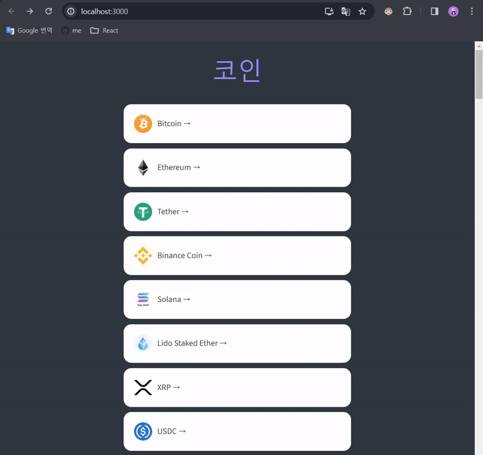

## 5.10 React Query part Two

> ### Devtools(Developer Tools)
>
> react query를 시각화 해주는 툴이다.  
> react query에 있는 devtools를 import 해오면 `cache`에 있는 query를 볼 수 있다.
>
> [react-query devtools](https://tanstack.com/query/v3/docs/framework/react/devtools)
>
> 💡 react query를 18버전 `@tanstack/react-query` 모듈을 설치했으면 아래 명령어로 따로 설치가 필요하다.
>
> ```
> npm i -D @tanstack/react-query-devtools
> ```
>
> &nbsp;

### React Query Devtools Floating 모드로 가져오기

```javascript
// App.tsx

import { createGlobalStyle } from "styled-components";
import Router from "./Router";
import { ReactQueryDevtools } from "@tanstack/react-query-devtools";

... 생략

function App() {
  return (
    <>
      <GlobalStyle />
      <Router />
      <ReactQueryDevtools initialIsOpen={true} />
    </>
  );
}

export default App;
```

- `initialIsOpen: Boolean` : `true`는 개발도구가 기본적으로 열려 있는 상태를 위해 설정

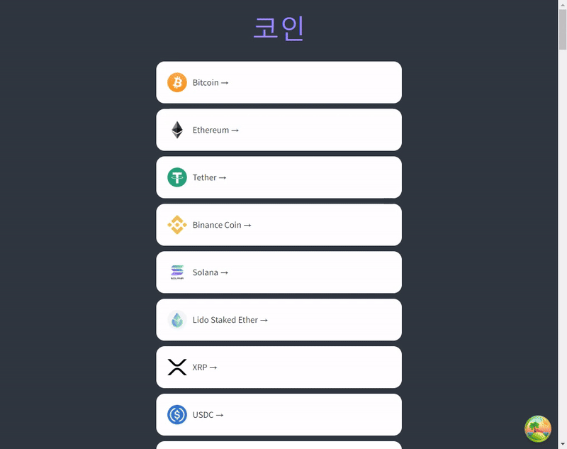

### 코인상세정보 페이지 React Query - `Coin.tsx`

현재 코인목록 페이지에서 코인상세정보 페이지로 들어가면 Loading이 나오는데 다시 돌아갔다가 와도 Loading이 나오는 상태이다.  
즉, 코인상세정보 페이지로 들어갈때마다 API에 접근하는 것을 의미한다.

```javascript
// Coin.tsx

const [loading, setLoading] = useState(true);
const [info, setInfo] = useState<InfoData>();
const [priceInfo, setPriceInfo] = useState<PriceData>();
useEffect(() => {
  (async () => {
    const infoData = await (
      await fetch(`https://api.coinpaprika.com/v1/coins/${coinId}`)
    ).json();
    // console.log("코인정보", infoData);
    const priceData = await (
      await fetch(`https://api.coinpaprika.com/v1/tickers/${coinId}`)
    ).json();
    // console.log("코인가격정보", priceData);
    setInfo(infoData);
    setPriceInfo(priceData);
    setLoading(false);
  })();
}, [coinId]);
```

1. fetcher 함수 만들기

   ```javascript
   // api.ts

   const BASE_URL = `https://api.coinpaprika.com/v1`;

    ...생략

   export function fetchCoinInfo(coinId: string) {
     return fetch(`${BASE_URL}/coins/${coinId}`).then((response) =>
       response.json()
     );
   }

   export function fetchCoinTickers(coinId: string) {
     return fetch(`${BASE_URL}/tickers/${coinId}`).then((response) =>
       response.json()
     );
   }
   ```

   - 반복되는 url 변수로 만들기
   - fetch url에 `coinId`를 사용하면 정의되지 않았다고 빨간줄이 뜨는데 각 fetcher함수 argument로 `coinId: string`을 넘겨준다.

2. `useQuery()`를 사용해 만들어둔 fetcher 함수 가져오기

   ```javascript
   function Coin() {
     ...생략
     const { isLoading: infoLoading, data: infoData } = useQuery<InfoData>({
       queryKey: ["info", coinId],
       queryFn: () => fetchCoinInfo(coinId),
     });
     const { isLoading: tickersLoading, data: tickersData } = useQuery<PriceData>({
       queryKey: ["tickers", coinId],
       queryFn: () => fetchCoinTickers(coinId),
       refetchInterval: 5000,
     });
     const loading = infoLoading || tickersLoading;
     return (
       <Container>
         <Header>
           <Title>
             {state?.name ? state.name : loading ? "Loading..." : infoData?.name}
           </Title>
         </Header>
         {loading ? (
           <Loader>Loading...</Loader>
         ) : (
           <>
             <Overview>
               <OverviewItem>
                 <span>Rank:</span>
                 <span>{infoData?.rank}</span>
               </OverviewItem>
               <OverviewItem>
                 <span>Symbol:</span>
                 <span>${infoData?.symbol}</span>
               </OverviewItem>
               <OverviewItem>
                 <span>Price:</span>
                 <span>${tickersData?.quotes.USD.price.toFixed(3)}</span>
               </OverviewItem>
             </Overview>
             <Description>{infoData?.description}</Description>
             <Overview>
               <OverviewItem>
                 <span>Total Suply:</span>
                 <span>{tickersData?.total_supply}</span>
               </OverviewItem>
               <OverviewItem>
                 <span>Max Supply:</span>
                 <span>{tickersData?.max_supply}</span>
               </OverviewItem>
             </Overview>

             ...생략
           </>
         )}
       </Container>
     );
   }
   ```

   - `queryKey`에 고유한 값인 coinId를 넣고 fetcher 함수들이 coinId가 필요한 상황이니 argument로 넣어준다.
   - `queryKey`는 고유한 값이므로 각각 다른 이름으로 바꿔준다.

     ```javascript
     const {} = useQuery({
       queryKey: ["info", coinId],
       queryFn: () => fetchCoinInfo(coinId),
     });
     const {} = useQuery({
       queryKey: ["tickers", coinId],
       queryFn: () => fetchCoinTickers(coinId),
     });
     ```

   - `isLoading`과 `data`도 각각 다른 이름으로 만든다.
   - info → infoData , priceInfo → tickersData로 변경해준다.
   - 하지만 타입스크립트는 `infoData`와 `tickersData`를 모르기때문에 useQuery 뒤에 만들어놨던 interface(`<InfoData>`,`<PriceData>`)를 붙여준다.

### 실행결과

이제 코인상세정보 페이지 > 코인목록 페이지 > 코인상세정보 페이지로 다시 들어와도 Loading 이 뜨지 않는다.

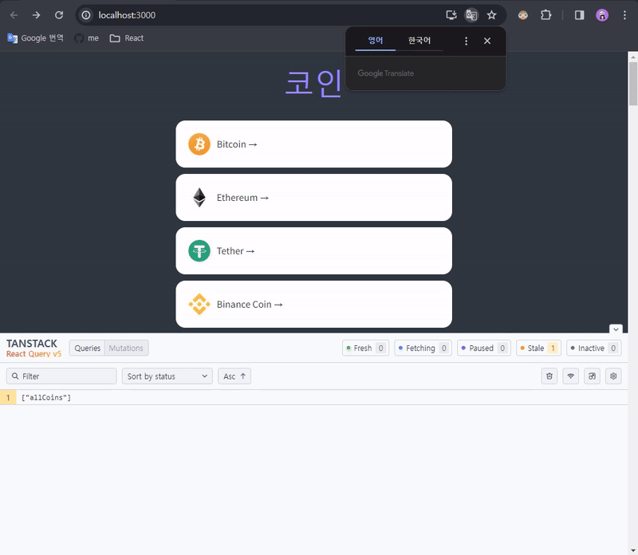

## 5.12 Price Chart One

> 🚨🚧🚨🚧🚨
>
> Coinpaprika API 는 더이상 무료가 아니다.
>
> 노마드코더 자체 API 제작
>
> 자체 URL:
>
> https://ohlcv-api.nomadcoders.workers.dev
>
> 사용을 위해서는. 파라미터로 coinId 를 추가하세요.
>
> https://ohlcv-api.nomadcoders.workers.dev?coinId=btc-bitcoin
>
> 🚨🚧🚨🚧🚨

### 코인상세정보 페이지에 차트 출력을 위해 API 데이터 불러오기

암호화페의 차트를 띄우기 위해서는 `Chart 컴포넌트`가 암호화폐(coinId)가 무엇인지 알아야한다.

코인상세정보 페이지에선 chart를 렌더링하고 URL로부터 이미 coinId 값을 가지고 있기 때문에 코인상세정보 페이지에서 props를 보내는 방법을 쓸 수 있다.


- 위와 같이 `Chart 컴포넌트`에 coinId를 props로 보낸다.

```javascript
// Chart.tsx

interface ChartProps {
  coinId: string;
}

function Chart({ coinId }: ChartProps) {
  return <h1>Chart</h1>;
}

export default Chart;
```

- 위와 같이 props이 `ChartProps` 라는 것을 정의해준다.

```javascript
// api.ts

export function fetchCoinHistory(coinId: string) {
  return fetch(
    `https://ohlcv-api.nomadcoders.workers.dev?coinId=${coinId}`
  ).then((response) => response.json());
}
```

- 차트를 만들기위해 필요한 API에 요청을 하기위해 fetcher 함수를 만든다.

```javascript
// Chart.tsx

import { useQuery } from "@tanstack/react-query";
import { fetchCoinHistory } from "./api";

interface IHistorical {
  time_open: number;
  time_close: number;
  open: string;
  high: string;
  low: string;
  close: string;
  volume: string;
  market_cap: number;
}

interface ChartProps {
  coinId: string;
}

function Chart({ coinId }: ChartProps) {
  const { isLoading, data } = useQuery<IHistorical[]>({
    queryKey: ["ohlcv", coinId],
    queryFn: () => fetchCoinHistory(coinId),
  });
  return <h1>Chart</h1>;
}

export default Chart;
```

- 만든 fetcher 함수를 가져오기위해 `useQuery()`를 만들어준다.
- fecher 함수에는 `coinId`가 필요하므로 `argument에 coinId`를 넣어준다.
- 타입스크립트는 `data`가 뭔지 모르니 `interface IHistorical`로 정의해준다.

### 실행결과

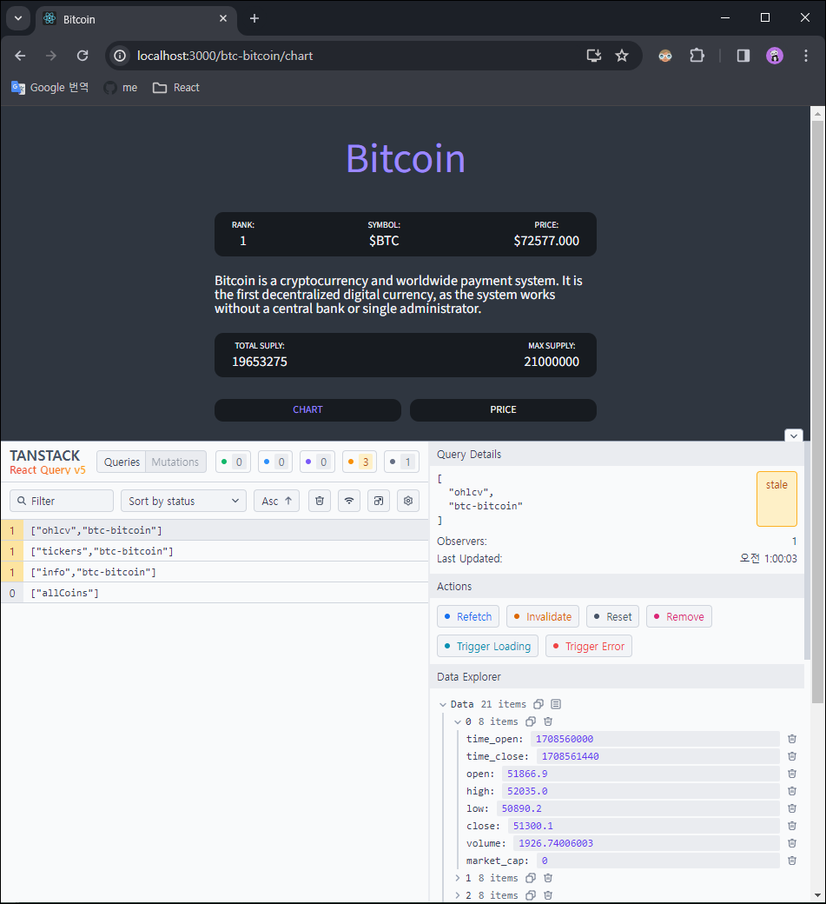

## 5.13 Price Chart Two

> ### APEXCHARTS
>
> : 수 많은 차트들을 만들 수 있는 자바스크립트 chart 라이브러리
>
> [APEXCHARTS - 공식문서](https://apexcharts.com/)  
> [APEXCHARTS - React Charts](https://apexcharts.com/docs/react-charts/)
>
> #### APEXCHARTS 설치
>
> ```
> npm install --save react-apexcharts apexcharts
> ```
>
> &nbsp;

```javascript
// Chart.tsx

import { useQuery } from "@tanstack/react-query";
import { fetchCoinHistory } from "./api";
import ApexChart from "react-apexcharts";

...생략

function Chart({ coinId }: ChartProps) {
  const { isLoading, data } = useQuery<IHistorical[]>({
    queryKey: ["ohlcv", coinId],
    queryFn: () => fetchCoinHistory(coinId),
  });
  return (
    <div>
      {isLoading ? (
        "Loading chart..."
      ) : (
        <ApexChart
          type="line"
          series={[
            {
              name: "Price",
              data: data?.map((price) => parseFloat(price.close)) ?? [],
            },
          ]}
          options={{
            theme: {
              mode: "dark",
            },
            chart: {
              height: 300,
              width: 500,
              toolbar: {
                show: false,
              },
              background: "transparent",
            },
            grid: { show: false },
            stroke: {
              curve: "smooth",
              width: 4,
            },
            yaxis: {
              show: false,
            },
            xaxis: {
              axisBorder: { show: false },
              axisTicks: { show: false },
              labels: { show: false },
            },
          }}
        />
      )}
    </div>
  );
}
```

- Chart 는 원래 컴포넌트명과 겹치니 `ApexChart`로 import 한다.
- `{isLoading ? "Loading chart" : <ApexChart/>}`  
  : 삼항연산자로 `isLaoding`이 true 이면 "Loading chart..." 문구를 출력하고 false 이면 `<ApexChart/>` 를 출력한다.
- `type` : 차트 유형
- `series` : 차트에 표시하려는 데이터
- `options` : 차트 구성 변경([공식문서참고](https://apexcharts.com/docs/options/annotations/) - 다양한 옵션들이 존재)

#### 🚨 문제발생

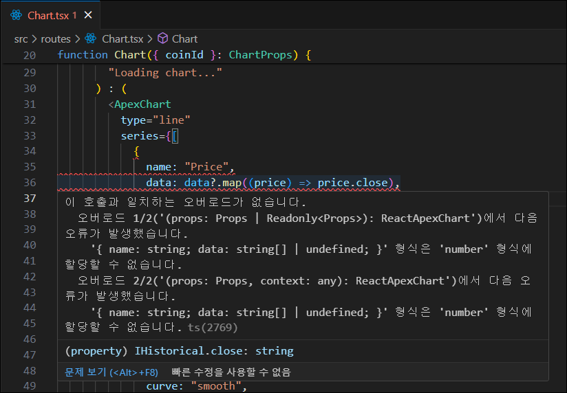

#### ✅ 해결방법

API는 close 데이터가 string 이기 때문에 `parseFloat`을 통해 형변환 해줬다.

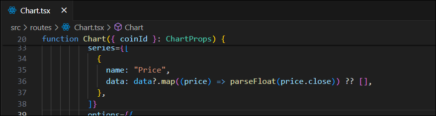

### 실행결과

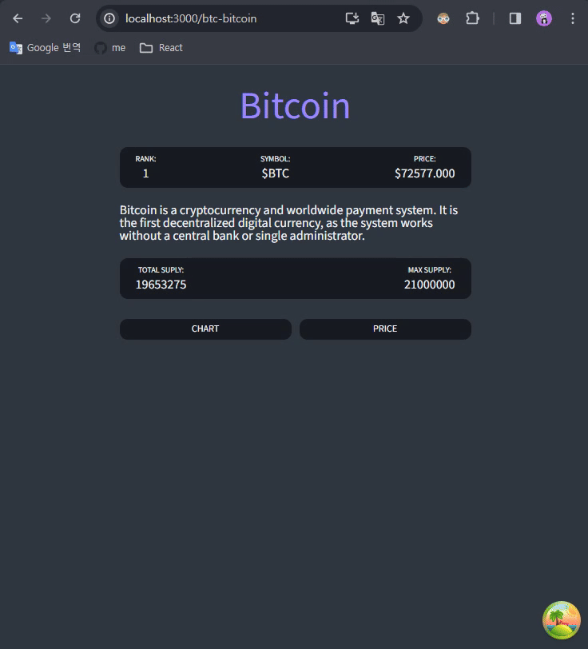

## 5.14 Price Chart Three

[APEXCHARTS - 차트꾸미기](https://apexcharts.com/docs/options/annotations/)  
[APEXCHARTS - Demo](https://apexcharts.com/javascript-chart-demos/)

```javascript
// Chart.tsx 일부

<ApexChart
  type="line"
  series={[
    {
      name: "Price",
      data: data?.map((price) => parseFloat(price.close)) ?? [],
    },
  ]}
  options={{
    theme: { mode: "dark" },
    chart: {
      height: 300,
      width: 500,
      toolbar: { show: false },
      background: "transparent",
    },
    grid: { show: false },
    stroke: {
      curve: "smooth",
      width: 3,
    },
    yaxis: { show: false },
    xaxis: {
      axisBorder: { show: false },
      axisTicks: { show: false },
      labels: { show: false },
      type: "datetime",
      categories: data?.map((price) => price.time_close) ?? [],
    },
    fill: {
      type: "gradient",
      gradient: { gradientToColors: ["#0be881"], stops: [0, 100] },
    },
    colors: ["#0fbcf9"],
    tooltip: {
      y: {
        formatter: (value) => `$ ${value.toFixed(2)}`,
      },
    },
  }}
/>
```

### 실행결과

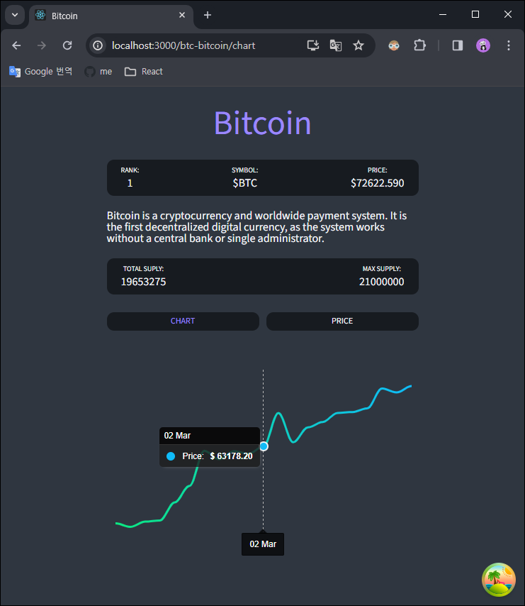

## 5.15 Final Touches

### 코인 가격을 실시간으로 보여주기 위해 5초마다 fetching 해주기

```javascript
const { isLoading: tickersLoading, data: tickersData } =
  useQuery <
  PriceData >
  {
    queryKey: ["tickers", coinId],
    queryFn: () => fetchCoinTickers(coinId),
    refetchInterval: 5000,
  };
```

- `useQuery()` 훅의 3번째 argument도 쓸 수 있다. (3번째는 선택적인 object이다.)
- `refetchInterval`을 사용해 query를 5초마다 refetch하면서 실시간으로 가격이 바뀐다.
- reat query devtools로 5초마다 fetching 처리되는 것을 확인 할 수 있다.

  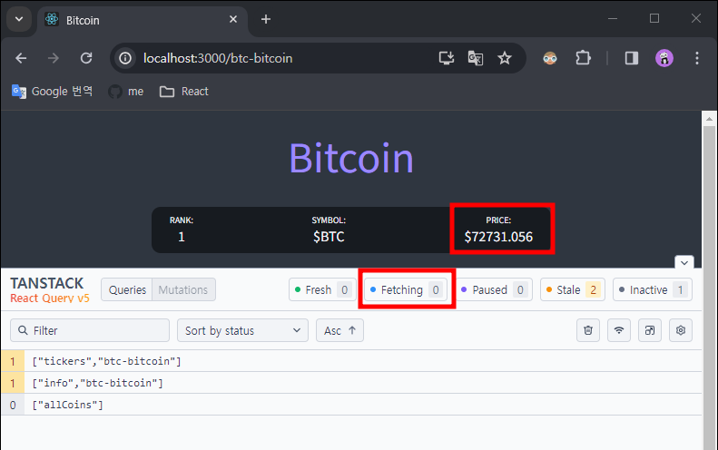

### React Helmet

> #### React Helmet
>
> : 무엇을 render하던 해당 사항이 문서의 `head`로 가게 만들어주는 component
>
> [NPM - react-helmet](https://www.npmjs.com/package/react-helmet)
>
> #### React Helmet 설치
>
> ```bash
> npm i react-helmet
> # 타입스크립트를 사용하면 아래 명령어도 실행
> npm i --save-dev @types/react-helmet
> ```
>
> &nbsp;

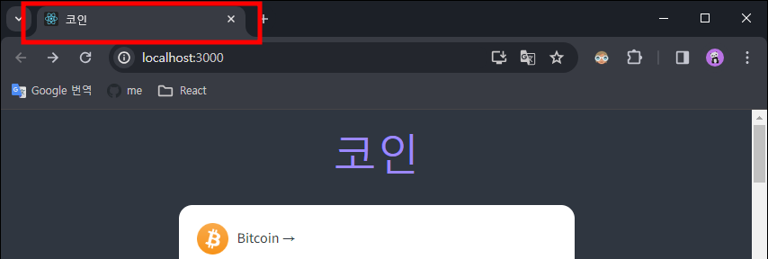

```javascript
// Coin.tsx

import { Helmet } from "react-helmet";

...생략

function Coin() {

  ...생략

  return (
    <Container>
     <Helmet>
        <title>
          {state?.name ? state.name : loading ? "Loading..." : infoData?.name}
        </title>
      </Helmet>

      <Header>
        <Title>
          {state?.name ? state.name : loading ? "Loading..." : infoData?.name}
        </Title>
      </Header>

      ...생략

    </Container>
  );
}

export default Coin;
```

- `Helmet` 으로 import한 후 `<Helmet>` 컴포넌트를 생성해 `<title>태그`를 render 한다.
- 안에 내용은 `<Title> 컴포넌트`와 동일하게 해준다.

### 실행결과

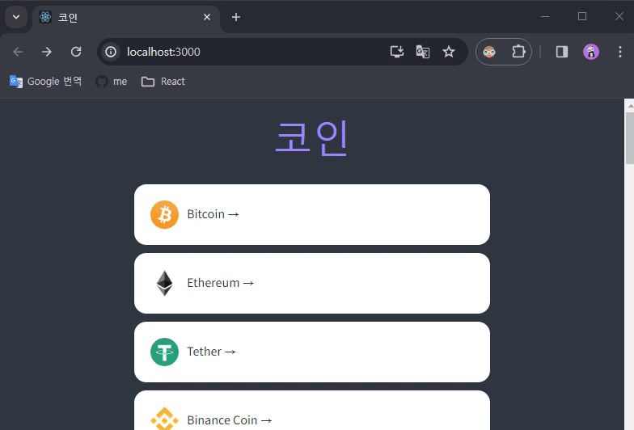
