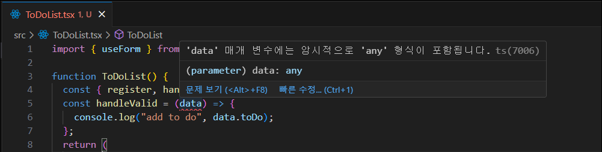
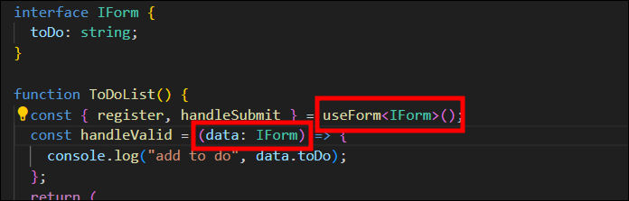
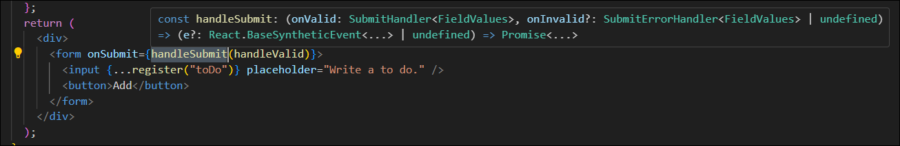
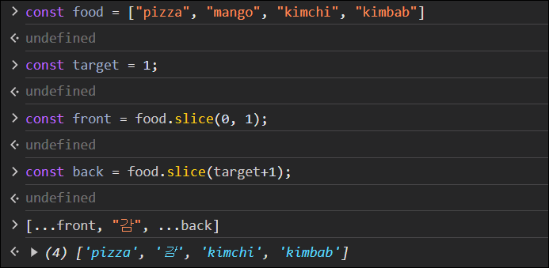
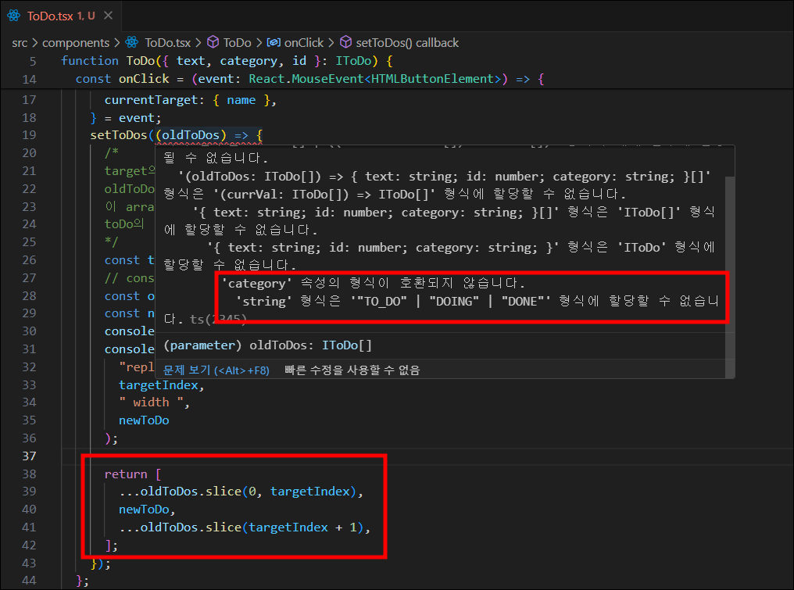
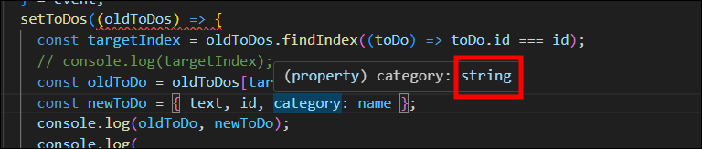

# #6 STATE MANAGEMENT

### 앞서 배웠던 React Hook Form 을 통해 todo input 만들기( `src>components>ToDoList.tsx` )

1. `useForm`을 호출한 후 객체에 `register`와 `handleSubmit`을 요청한다.

   ```javascript
   import { useForm } from "react-hook-form";

   const { register, handleSubmit } = useForm();
   ```

2. input에 객체 리터럴(`{ }`)을 열고, `...register`, 인자로 input의 이름을 넣어준다.

   ```javascript
   <form onSubmit={}>
     <input {...register("toDo")} placeholder="Write a to do." />
     <button>Add</button>
   </form>
   ```

3. onSubmit 함수 만들기(내가만든 함수)

   - 인자로는 `data`를 받는다.
   - 출력이 잘되는지 `console.log("add to do", data.toDo);` 로 확인한다.  
      (input에서 인자로 넣은 input의 이름이 data에 들어간다.)

    

   - data 매개변수에 타입이 없어서 타입스크립트가 에러를 발생한다.
   - `interface IFrom`를 만들어 정의해준다.
   - 만든 `IFrom`을 userForm뒤에 넣어주고, data의 타입도 `IFrom`으로 표시해준다.

    

4. 내가만든 함수를 form onSubmit에 넣어준다.

- `handleSubmit` 함수 사용시 첫번째 매개변수로 데이터가 유효할때 호출되는 다른 함수를 받는다.
- 원한다면 데이터가 유효하지 않았을때 호출될 다른 함수를 두번째 매개변수로 넣을 수 있다.

    

5. input의 toDo 유효성 검사 만들기

   - 객체 리터럴을 만들고 `required: true` 아니면 메세지를 넣는다.

   ```javascript
   <input
     {...register("toDo", { required: "Please Write a To Do." })}
     placeholder="Write a to do."
   />
   ```

6. 입력값이 submit이 되고, 값이 검사를 통과하면 input의 내용 비우기

   - `setValue` 함수를 사용해 toDo 의 값을 빈 문자열로 변경한다.

   ```javascript
   const { register, handleSubmit, setValue } = useForm<IForm>();
    const handleValid = (data: IForm) => {
      console.log("add to do", data.toDo);
      setValue("toDo", "");
    };
   ```

## 6.11 Add To Do

Recoil 연습이 될거임
Recoil을 사용해 toDoList 만들기

## 6.12 Refactoring

ToDoList 파일 분리

## 6.13 Categories

## 6.14 Immutability part One

```
[
  {
      "text": "5",
      "id": 1710479153152,
      "category": "TO_DO"
  },
  {
      "text": "4",
      "id": 1710479152792,
      "category": "TO_DO"
  },
  {
      "text": "3",
      "id": 1710479152206,
      "category": "TO_DO"
  },
  {
      "text": "2",
      "id": 1710479151531,
      "category": "TO_DO"
  },
  {
      "text": "1",
      "id": 1710479151104,
      "category": "TO_DO"
  }
]
```

1. 수정하고자 하는 to do의 경로를 알아야한다.
   - target 의 경로 찾기
   - id로 to do 찾기
   - array 안에 있는 object의 index를 찾는 방법을 알면된다.
   ```javascript
   const targetIndex = oldToDos.findIndex((toDo) => toDo.id === id);
   console.log(targetIndex);
   ```
2. 새 category로 새로운 to do를 만들어서 원래의 to do를 update
   ```javascript
   const oldToDo = oldToDos[targetIndex];
   const newToDo = { text, id, category: name };
   console.log(oldToDo, newToDo);
   ```
3. targetIndex 에 있는 to do를 newToDo 로 변경

순서변동없이 "mango" 를 "감"으로 변경하기


#### 🚨 문제발생

category 속성의 형식이 호환되지 않는 문제가 발생했다.  
category라는 prop의 타입은 `"TO_DO", "DOING", "DONE"` 중 하나인데 `newToDo`의 category는 `string` 이기 때문이다.





### ✅ 해결방법

`newToDo`의 category 타입을 정의해준다.

```javascript
// any : 타입스크립트 검사 X - 권장하는 방법은 아니다.
const newToDo = { text, id, category: name as any };
// 직접적으로 정의
const newToDo = { text, id, category: name as "TO_DO" | "DOING" | "DONE" };
// 인터페이스로 정의
const newToDo = { text, id, category: name as IToDo['category'] };
```

## 6.16 Selectors part One

[Recoil - Selectors](https://recoiljs.org/ko/docs/basic-tutorial/selectors)

## 6.17 Selectors part Two

카테고리 선택하는 걸로 변경함

## 6.18 Enums

현재는 새 toDo를 추가할때 "TO_DO" 카테고리로 들어간다.  
새 toDo 작성시 선택한 카테고리(categoryState)에 맞게 출력해보기!
