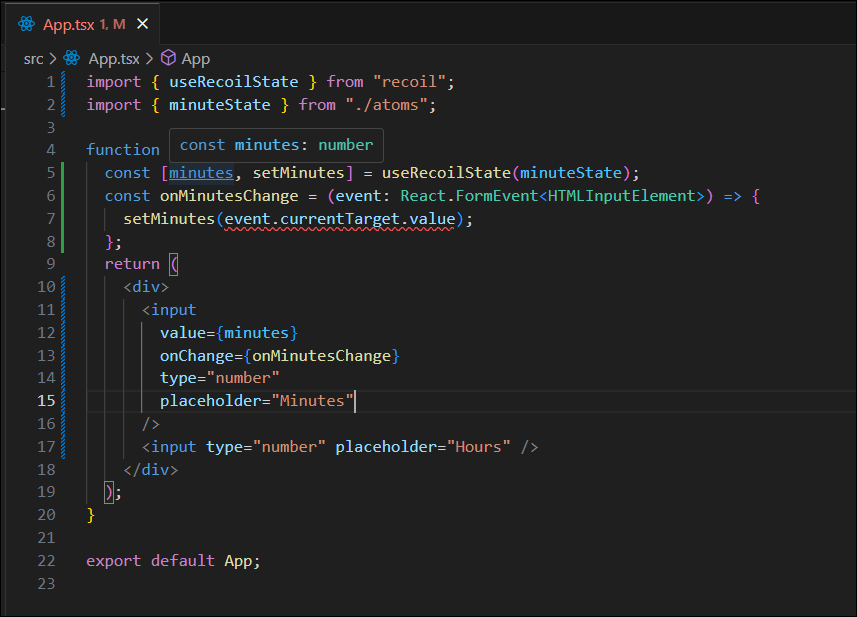

# #7 TRELLO CLONE

### 간단한 시간변환기 만들기

```bash
# 프로젝트 생성
npx create-react-app myApp --template typescript
# Styled Components 설치
npm i styled-components
# Recoil 설치
npm i recoil
```

## 7.0 Get Selectors

#### 🚨 문제발생

`minutes`의 타입은 `number`타입인데 input에서 넘어오는 값은 `string`이므로 `event.currentTarget.value`에 오류발생



#### ✅ 해결방법

`+`를 넣어 string을 number로 변경한다.

```javascript
const onMinutesChange = (event: React.FormEvent<HTMLInputElement>) => {
  setMinutes(+event.currentTarget.value);
};

// "1" -> +"1" -> 1
```

## #7.1 Set Selectors
