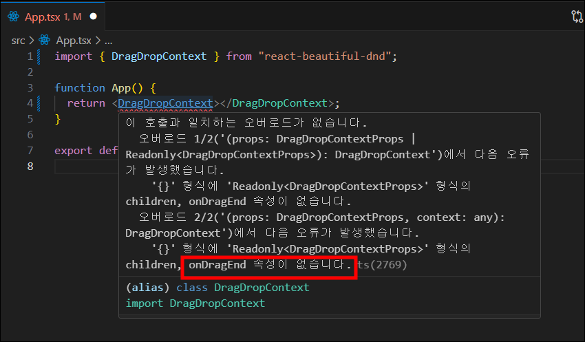
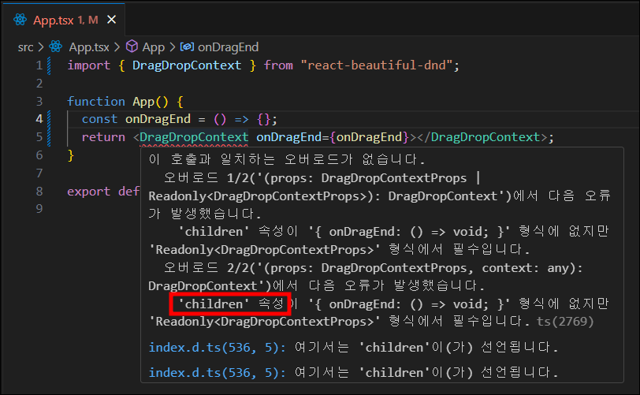
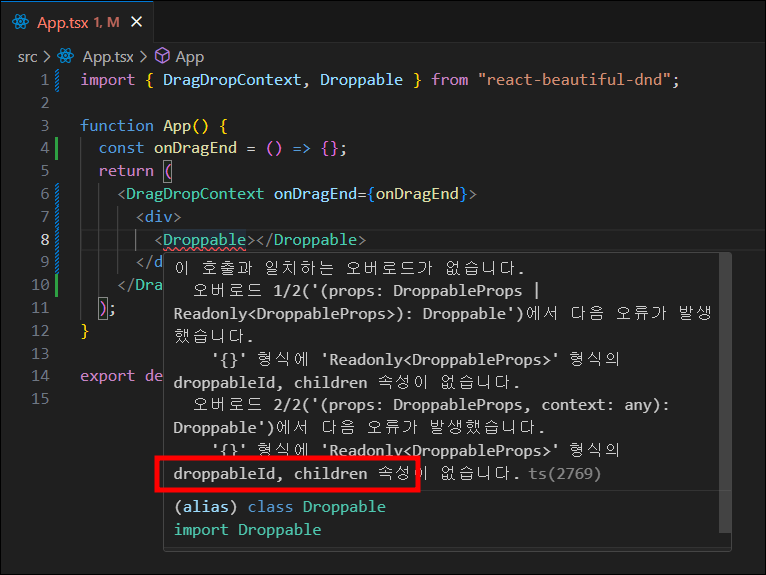
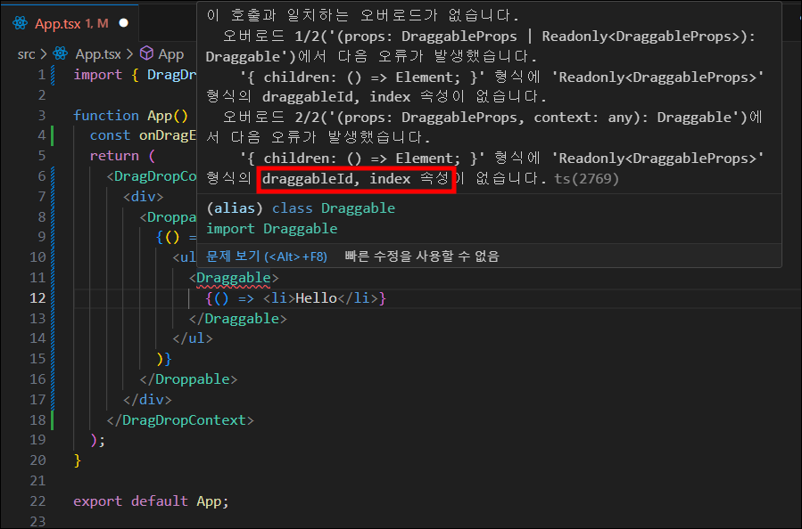
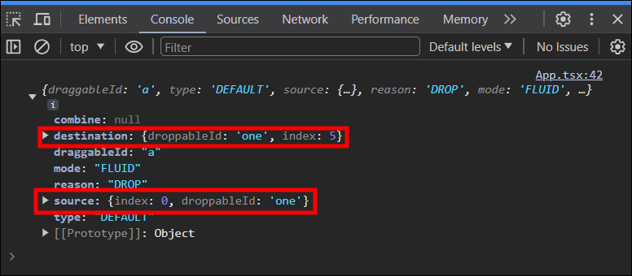
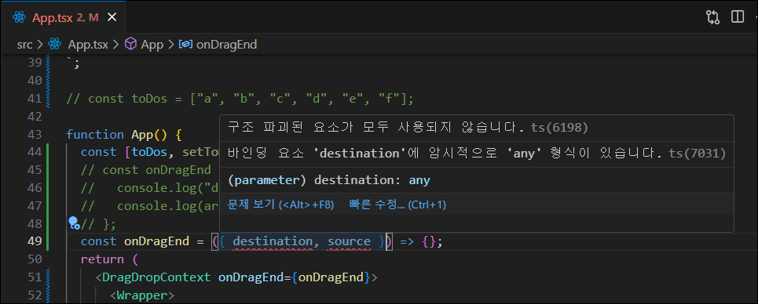
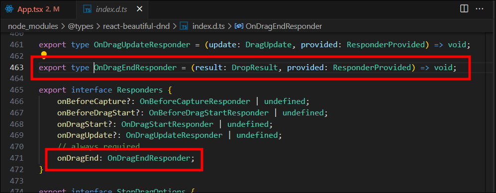
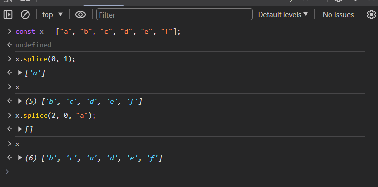

# #7 TRELLO CLONE

### 드래그 앤 드롭 리스트 만들기

## 7.2 Drag and Drop part One

> ### react-beautiful-dnd
>
> [NPM - react-beaytiful-dnd](https://www.npmjs.com/package/react-beautiful-dnd?activeTab=readme)
>
> ```bash
> # 설치
> npm i react-beautiful-dnd
> # 타입스크립트에 react-beautiful-dnd 정의
> npm i --save-dev @types/react-beautiful-dnd
> ```







## 7.3 Drag and Drop part Two

## 7.4 Styles and Placeholders

## 7.5 Reordering

아이템 드롭시 재정렬



#### 🚨 문제발생

argument로 `destination`과 `source`를 가져오는데 타입스크립트 에러발생



#### ✅ 해결방법

argument안에 `DropResult`로 타입을 정의해주면된다.

```javascript
const onDragEnd = ({ destination, source }: DropResult) => {};
```

`onDragEnd` 이벤트에 `ctrl + 클릭` 해서 살펴보면 아래와 같이 `onDragEnd` 함수가 어떻게 생겼는지 알려주고 있다.



### splice 메소드



## 7.6 Reordering part Two

## 7.7 Performance

react memo : react한테 prop이 바뀌지 않는다면 컴포넌트를 렌더링 하지말라고한다.

현재 react 18.2 버전에서는 memo(컴포넌트명, arePropsEqual?)로 사용합니다.

1. [레거시](https://ko.legacy.reactjs.org/docs/react-api.html#reactmemo)

   ```javascript
   import React from "react";
   export default React.memo(DraggableCard);
   ```

2. [현재](https://react.dev/reference/react/memo)

   ```javascript
   import { memo } from "react";
   export default memo(DraggableCard);
   ```
